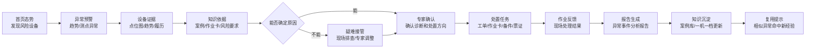

# 输油泵智能运维助手 demo 演示方案

> 文档用途：给业务方确认首版 demo 做什么、怎么演、需要补什么材料。  
> demo 定位：参赛 / 立项用的定制演示 demo，不是生产系统、不是试点 MVP。  
> 实现口径：预置演示数据 + 页面交互 + 流程状态变化 + 预设知识命中与报告样例。

---

## 1. 先说结论

首版 demo 建议只做一条主线、四个演示场景。

主线：

```text
泵机组集中监测诊断管理
```

四个演示场景：

```text
场景 1：异常怎么发现
场景 2：依据怎么找到
场景 3：处置怎么闭环
场景 4：经验怎么复用
```

这条主线能覆盖参赛作品最想表达的价值：

```text
从被动维修
  变成
提前发现、依据可查、专家把关、处置闭环、经验复用的智能运维。
```

## 2. 为什么不做“大而全”

业务材料里有五类流程：集中监测诊断、日常巡检、计划性维护、项修、大修。首版 demo 不建议全部做。

| 业务流程图 | 首版定位 | 原因 |
|---|---|---|
| 泵机组集中监测诊断管理 | **主线** | 它能一次讲清“预警、诊断、处置、复盘、经验复用”，最能代表项目立项价值 |
| 泵机组日常巡检管理 | 扩展入口 | 可作为后续场景，不做完整流程 |
| 泵机组计划性维护保养（4K） | 扩展入口 | 偏计划保养，冲突感不如异常诊断强 |
| 泵机组项修 | 后续扩展 | 审批、物料、作业周期更长 |
| 泵机组大修 | 后续扩展 | 流程太重，不适合首版 demo |
| 输油泵机组仪表点位图 | 页面素材 | 用于设备详情页，高亮异常测点 |

首版目标不是“把所有流程都做了”，而是先让领导和评委相信：

```text
这条智能运维闭环是成立的，值得立项继续做。
```

## 3. 首版 demo 演示主线



这张图就是首版 demo 的骨架。业务方讨论时，只需要围绕这条线补充材料和取舍节点。

## 4. 业务会看到的 4 个演示场景

| 场景 | 业务方看到什么 | 证明什么 |
|---|---|---|
| 1. 异常发现 | 首页风险设备、仪表点位图、异常测点高亮、趋势曲线 | 异常有证据，不是随便弹窗 |
| 2. 知识找依据 | 命中相似案例、标准作业卡、HSE 风险要求，建议旁边显示引用依据 | 数智员工不是黑盒，有业务依据 |
| 3. 处置闭环 | 专家确认、工单、作业卡、备件、票证、现场反馈、报告预览 | 预警能推动实际处置，不是单点功能 |
| 4. 经验复用 | 报告生成后形成新增案例，一机一档展示更新；模拟相似异常命中新经验 | 经验不是归档，而是能下次复用 |

## 5. 知识依据怎么演（RAG / 企业知识库）

首版不需要真实知识库引擎，也不需要真实大模型。业务只需要看到三件事：

```text
1. 知识从哪里来
2. 建议引用了哪些依据
3. 本次经验下次能不能复用
```

建议页面这样设计：

```text
异常发生后：
  页面显示“正在检索企业知识库”

检索完成后：
  命中相似案例 3 条
  命中标准作业卡 2 条
  命中 HSE 风险要求 1 条

研判建议旁边：
  标注“参考案例 / 作业依据 / 风险要求”

报告生成后：
  抽取本次处理结果，形成新增案例样例

复用验证：
  模拟下一次相似异常，命中刚刚沉淀的新案例
```

这里可以把 RAG 解释成一句业务话：

```text
不是让 AI 凭空回答，
而是让系统先从企业知识库找依据，
再基于依据给出排查建议和报告内容。
```

## 6. AI 和人工分别做什么

这个 demo 不应表达成“AI 自动处理一切”。更合理的说法是：

```text
数智员工负责辅助，
专家和作业人员负责确认与执行。
```

| 环节 | 数智员工 / 系统辅助 | 人工接入点 |
|---|---|---|
| 异常发现 | 汇总趋势、测点、预警事件 | 监视中心查看 |
| 找依据 | 命中案例、作业卡、风险要求 | 业务人员查看依据 |
| 研判 | 给出疑似原因和排查步骤 | 专家确认；无法确定时转疑难接管 |
| 处置 | 生成工单、作业卡、备件、票证关系 | 管理人员确认 |
| 执行 | 引导现场反馈 | 作业区人员提交处理结果 |
| 报告 | 生成报告样例 | 专家发布确认 |
| 入库 | 抽取案例摘要 | 技术人员确认入库 |
| 复用 | 下次相似异常命中经验 | 人员确认是否采用建议 |

## 7. 业务方需要补哪些材料

请业务方只优先确认 6 项关键材料，其余可以由技术方先代拟，再由业务确认。

### 7.1 必须优先确认的 6 项

| 材料 | 用在 demo 哪一步 | 最低要求 |
|---|---|---|
| 主角泵设备信息 | 首页、设备详情 | 站场名、设备名、设备编号可脱敏 |
| 仪表点位图 | 设备详情 | 已提供，可确认哪个测点作为异常点 |
| 相似故障案例 2-3 条 | 知识依据、复用验证 | 可脱敏；没有则由技术方构造，业务确认 |
| 标准作业卡 / 指导书样例 | 处置建议 | 提供 1-2 份样例或栏目结构 |
| 报告模板 | 报告预览 | 提供报告栏目或历史报告脱敏样例 |
| 一机一档字段 | 知识沉淀 | 确认要展示哪些更新字段 |

### 7.2 可以技术方先代拟的材料

| 材料 | 处理方式 |
|---|---|
| 72 小时趋势曲线 | 技术方构造，业务确认“像真的” |
| 异常事件描述 | 技术方按主线代拟，业务改措辞 |
| HSE 风险要求 | 技术方先放通用样例，业务确认 |
| 工单 / 备件 / 票证样例 | 技术方代拟字段，业务确认是否符合流程 |
| 复用验证样例 | 技术方根据新增案例代拟 |

## 8. 首版 demo 怎么实现

首版建议做成定制演示 demo：

```text
预置演示数据
页面交互
趋势曲线
知识命中卡片
工单状态流转
报告预览
复用验证卡片
```

实现重点：

```text
页面能点
状态能变
流程能走完
依据能看见
报告能生成样例
知识能沉淀并复用展示
```

不需要：

```text
真实 AI API
真实 RAG 引擎
真实 IMS / PI / HSE / PPS / 供应链接口
真实模型训练
```

具体实现方式由技术方内部处理，业务方只需要确认演示主线、业务素材和演示效果。

## 9. 排期建议：15 天制作 + 5 天冗余

| 阶段 | 时间 | 交付内容 |
|---|---|---|
| 第 1-2 天(7.19) | 业务确认 | 锁定主角设备、故障场景、演示主线、材料清单 |
| 第 3-5 天 | 数据与骨架 | 演示数据、首页、设备详情、趋势图、主流程图 |
| 第 6-9 天 | 核心闭环 | 知识命中、研判复核、处置任务、作业反馈 |
| 第 10-12 天 | 报告与复用 | 报告预览、知识沉淀、相似异常复用提示 |
| 第 13-15 天 | 联调交付 | 演示脚本、页面细节、业务术语校正、交付彩排 |
| 冗余 5 天 | 缓冲 | 业务素材变更、文案调整、演示彩排、现场兜底 |

## 10. 本次不做什么

| 不做项 | 原因 |
|---|---|
| 五大业务场景全量平台 | 首版 demo 会变散，主线讲不清 |
| 真实生产系统接口 | 权限、联调、数据安全不可控 |
| 真实 AI 接入 | 现场稳定性和输出可控性不足 |
| 真实 RAG / 向量库 | 首版用知识命中可视化即可表达价值 |
| 真实 OCR / 图像识别 | 不是首版主线价值 |
| 原生 App | 移动端样式页足够表达现场反馈 |
| 深度模型训练 | 数据积累不足，属于正式项目 |

说明：这些不是永远不做，而是本次立项 demo 不做；正式项目立项后可以逐项接入。

## 11. 业务方需要拍板的 6 个问题

| 编号 | 问题 | 推荐答案 |
|---|---|---|
| Q1 | 首版主线是否选“集中监测诊断管理” | 是 |
| Q2 | 故障场景选哪类 | 推荐选业务最容易确认的异常振动 / 轴承类 / 不对中类之一 |
| Q3 | 是否接受首版 demo 不接真实系统 | 接受 |
| Q4 | 是否接受不接真实 AI，用预设示例展示数智员工效果 | 接受 |
| Q5 | RAG 是否按“知识命中 + 引用依据 + 沉淀复用”展示 | 是 |
| Q6 | 业务素材由谁确认 | 业务提供关键样例，技术方补齐，业务最终确认合理性 |

## 12. 最终交付物

```text
1. 可运行的演示 demo
2. 一套演示数据
3. 一条完整演示主线
4. 知识依据命中展示
5. 处置状态流转展示
6. 报告预览与复用提示
7. 演示讲解脚本
```

一句话收口：

```text
这次 demo 不证明生产系统已经建成，
而是证明“输油泵智能运维助手”这条业务闭环值得立项，
并且可以用定制演示 demo 稳定、清楚地讲出来。
```
