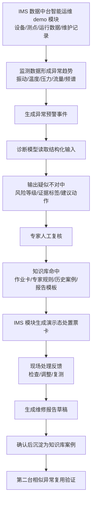

# 01. 业务流程闭环

> 本文负责：定义 demo 运行时业务闭环。  
> 本文不负责：说明素材原文怎么来的；素材只在 [06-素材抽取与待补清单.md](06-素材抽取与待补清单.md) 中维护。  
> 关键口径：流程起点不是业务素材文件，而是 IMS 数据中台上的智能运维 demo 模块中形成的异常趋势或预警事件。

## 主线选择

首版只做一条完整闭环：

```text
长岭站 P-1 输油泵机组疑似不对中预警处置闭环
```

选择原因：

| 判断点 | 结论 |
|---|---|
| 业务价值 | 能讲清预警、诊断、复核、处置、报告、知识复用 |
| 数据可构造 | 可从 P1 检测报告抽取振动、频谱、相位、设备测点样例 |
| 处置可闭环 | 可从 P1 对中作业卡抽取标准处置步骤 |
| 演示可控 | 不依赖真实接口和真实模型训练 |
| 后续可扩展 | 可扩展到轴承磨损、不平衡、大修周期、巡检等场景 |

## 运行时主流程



## 节点输入输出

| 节点 | 运行时输入 | 运行时输出 | demo 展示 |
|---|---|---|---|
| IMS 智能运维 demo 模块 | 设备台账、测点、运行数据、维护记录、作业卡、报告模板 | 可被页面和模型读取的模块内结构化数据 | 一泵一档、测点图、数据来源标签 |
| 异常趋势识别 | 振动、温度、压力、流量、阈值、频谱特征 | 异常预警事件 | 风险看板出现 P1 关注事件 |
| 诊断模型 | 设备、测点、时序、阈值、频谱、相位 | 疑似故障、风险等级、证据标签、建议动作 | 诊断结果卡、证据链 |
| 人工复核 | 诊断输出、证据链、业务上下文 | 确认继续处置或驳回 | 专家确认按钮和意见 |
| 知识命中 | 故障类型、证据标签、设备标签、建议动作 | 作业卡、专家规则、历史案例、报告模板 | 知识命中卡 |
| 处置票卡 | 复核结果、作业卡、人员角色、许可字段 | IMS 演示态处置票卡 | 标准化处置步骤 |
| 现场反馈 | 处置票卡、复测数据、处理记录 | 调整记录、复测结果、验收结论 | 反馈表单 |
| 报告生成 | 诊断证据、处置过程、反馈结果 | 维修报告草稿 | 报告预览 |
| 案例入库 | 确认报告、证据、标签、处置结论 | 新知识库案例 | 入库确认卡 |
| 复用验证 | 第二台相似异常、已入库 P1 案例 | 命中 P1 案例并推荐同类处置 | 复用验证卡 |

## 素材和流程的关系

业务素材只服务于“构造运行时数据”：

```text
P1 检测报告
  -> 抽取设备、测点、振动值、频谱、相位、诊断样例
  -> 形成 IMS 模块内结构化演示数据和模型入参样例

P1 对中作业卡
  -> 抽取角色、许可、工具、步骤、验收项
  -> 形成知识库作业卡和 IMS 模块内处置票卡样例

历史报告 / 说明材料
  -> 抽取报告结构、案例标签、专家经验
  -> 形成知识库文档样例和报告模板
```

这些素材不在演示时作为文件上传或模型输入出现。

## 不纳入首版完整闭环的业务线

| 业务线 | 首版处理 | 原因 |
|---|---|---|
| 轴承磨损诊断 | 作为后续故障类型 | 需要对应频谱证据、阈值、处置作业卡 |
| 不平衡诊断 | 作为后续故障类型 | 可复用诊断框架，但首版不展开 |
| 计划性维护保养 | 作为后续场景 | 偏计划任务，不如异常诊断有冲突感 |
| 大修周期预测 | 作为二期场景 | 需要泵效测试、预测性维修标准和周期规则 |
| 日常巡检 | 作为后续场景 | 可承接三级监视体系，但首版先讲诊断闭环 |
