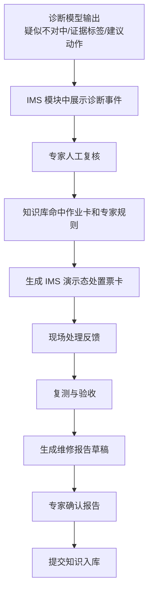

# 04. IMS 处置与报告闭环

> 本文负责：定义 IMS 数据中台上的智能运维 demo 模块如何承载诊断结果、处置、反馈、报告和知识入库。  
> 本文不负责：真实生产流程改造、真实 HSE 办票、真实供应链联动。  
> 关键口径：本 demo 是 IMS 数据中台上的一个智能运维演示模块，流程状态只在模块内结构化演示数据中流转，首版不承诺真实生产流程改造。

## IMS 在 demo 里的角色

IMS 本身就是数据中台。本 demo 定位为 IMS 数据中台上的智能运维演示模块，模块内消费以下结构化数据：

```text
设备台账
测点模型
运行数据
维护记录
作业卡
报告模板
模块内演示态流程状态
```

诊断模型从该 IMS 模块内的结构化数据和监测回放样例中读取输入；诊断结果仍在同一 IMS 模块内流转，由人工确认后进入处置闭环。

## 处置闭环

下图只描述“异常预警事件已经在 IMS 数据中台智能运维 demo 模块内形成，并完成诊断模型输出之后”的处置子流程；完整主流程见 [01-业务流程闭环.md](01-业务流程闭环.md)。



## 核心业务对象

| 对象 | 何时创建 | 承载内容 |
|---|---|---|
| 异常预警事件 | 监测数据触发异常趋势后 | 设备、测点、异常指标、流程状态 |
| 诊断结果 | 模型处理结构化输入后 | 疑似故障、风险等级、证据标签、建议动作 |
| 处置票卡 | 专家确认需要处置后 | 作业卡、角色、许可字段、步骤、反馈入口 |
| 现场反馈 | 现场处理后 | 调整记录、复测数据、验收结论 |
| 维修报告草稿 | 反馈完成后 | 诊断依据、处置过程、复测结果、经验总结 |
| 知识入库申请 | 报告确认后 | 标签、证据引用、处置结论、复用建议 |

## 人工确认点

| 人工点 | 位置 | demo 行为 |
|---|---|---|
| 诊断复核 | 模型输出后 | 专家确认或驳回诊断 |
| 处置确认 | 生成票卡前 | 确认使用对中作业卡 |
| 现场反馈 | 处置后 | 填写调整记录和复测数据 |
| 报告确认 | 报告草稿后 | 确认报告可归档 |
| 知识审核 | 案例入库前 | 确认案例可被复用 |

## HSE 和供应链边界

| 能力 | 首版呈现 | 不宣称 |
|---|---|---|
| HSE 作业票证 | 处置票卡里出现许可/JSA 字段 | 不宣称真实 HSE 办票 |
| 供应链备件 | 可出现备件需求或“无需备件”字段 | 不宣称真实采购、库存、厂商派单 |
| 生产流程 | 使用 IMS 模块内结构化演示数据 | 不宣称真实生产流程改造 |

## 报告闭环

报告草稿不是模型直接生成，而是基于闭环过程自动汇总：

| 报告段落 | 数据来源 |
|---|---|
| 事件概况 | 异常预警事件 |
| 设备信息 | IMS 一泵一档 |
| 异常数据与诊断依据 | 趋势、阈值、频谱、相位、诊断输出 |
| 处置过程 | 处置票卡、现场反馈 |
| 复测与验收 | 处置后振动 / 温度 / 运行状态 |
| 经验总结 | 故障标签、专家意见、复用建议 |
