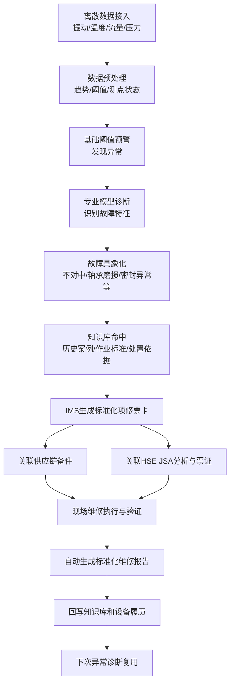

我认为你这次补充后，demo 逻辑应该重新校准成：

**不是“做一个监测诊断大屏”，而是：**

```text
离散运行数据
  -> 阈值 / 专业模型识别异常
  -> 转成可理解的故障特征
  -> 知识库 / 智能体给出处置依据
  -> 进入 IMS 标准化项修 / 维保 / 大修流程
  -> 关联备件、HSE、现场记录
  -> 生成报告
  -> 回写知识库与设备履历
  -> 下一次复用
```

核心纠正是：**专业模型、知识库、大模型问答不是一回事。**

```text
基础阈值预警：
判断“有没有异常”
例如振动、温度、流量、压力是否越限或趋势异常。

数据预处理：
把离散数据整理成可判断的趋势、特征、时间片、测点状态。

专业模型诊断：
判断“异常像什么故障”
例如不对中、轴承磨损、密封异常、泵效下降等。
这是专业能力，不应该让大模型凭空猜。

RAG / 企业知识库：
判断“这个故障怎么解释、怎么处置、有无历史案例、对应什么票卡”
它负责找依据、找案例、找标准作业方案。

NLP / 大模型问答：
负责“把结论说清楚、问答、生成报告、辅助解释”
它不是故障判定源头，不应直接替代专业模型。
```

**这几张图的优先级，我建议这样重新理解：**

| 图片业务线 | demo 中定位 | 优先级 |
|---|---|---|
| 泵机组项修 | 主线闭环：异常识别后进入标准化项修 | 1 |
| 泵机组计划性维护保养 | 第二场景：按运行状态 / 周期 / 标准触发维保 | 2 |
| 泵机组大修 | 第三场景：用泵效 + 运行状态辅助判断是否大修 | 3 |
| 泵机组日常巡检管理 | 辅助场景：体现三级监视、减轻作业区盯屏压力 | 4 |
| 泵机组集中监测诊断管理 | 底层能力入口，不单独作为最终业务闭环 | 5 |
| 输油泵机组仪表点位图 | 页面素材：展示异常测点、数据来源、部件定位 | 素材 |

所以 demo 主线我建议改成：



**demo 的第一主线应该是“异常驱动项修”。**

因为它最完整、冲突最强、最能体现立项价值：

```text
过去：
数据散、靠人看、靠经验判断、票卡和备件/HSE割裂、报告靠人工写。

demo 要证明：
系统能把异常数据变成故障判断，
再把故障判断变成标准化项修动作，
最后形成报告和知识沉淀，并能下次复用。
```

**计划性维保、大修、巡检不要全部做深。**

建议做成三个“扩展入口”：

```text
项修：完整演示闭环，做深。

计划性维保：展示入口和一条轻流程，证明未来能扩展。

大修：重点展示“泵效 + 运行状态辅助判断是否需要大修”，不要完整展开大修全流程。

巡检：展示三级监视体系和作业区减负，不做复杂巡检系统。
```

我还有几个关键疑惑，明天必须问业务方，否则 demo 数据和演示效果会跑偏：

1. **首版主故障选哪个？**
   是不对中、轴承磨损、密封异常，还是泵效下降？建议只选 1 个主故障。

2. **所谓“专业模型”现在有没有现成规则或算法？**
   如果没有，demo 就用“预置模型诊断结果 + 可解释阈值/趋势”演示，不承诺真实模型。

3. **异常阈值谁来定？**
   是国家/集团标准、厂家建议、专家经验，还是业务方给示例阈值？

4. **IMS 项修票卡具体长什么样？**
   需要业务方提供一张脱敏样例，否则只能做模拟票卡。

5. **HSE 的 JSA 分析和票证智能办理具体包括哪些字段？**
   不能瞎猜，要确认是作业风险分析、动火/受限空间/高处等票证，还是普通检修票。

6. **供应链备品备件要展示到什么程度？**
   是只展示“推荐备件 + 库存状态”，还是要展示申领流程？

7. **知识库复用怎么体现？**
   建议必须加一个“复用验证”：本次报告沉淀后，下一台相似异常能命中这条案例。

8. **大模型问答是否真的要可问？**
   如果只是立项 demo，建议做限定问答，不做开放式 AI API，保证现场稳定。

结论：你现在的判断是对的，demo 架构必须拆成 **专业模型诊断层 + 知识库依据层 + 问答/报告表达层 + IMS业务闭环层**。主线优先级也应该从“集中监测诊断”调整为“异常驱动项修闭环”，诊断只是入口能力，不是最终业务价值本身。