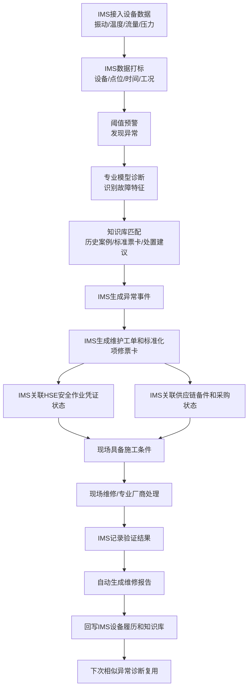

是的，需要重新梳理 demo 架构，但不是推倒重来，而是**纠正系统边界**。

之前如果把 IMS、HSE、供应链当成几个并列系统来演示，就容易跑偏。现在应该改成：

```text
demo 部署在 IMS 系统里
IMS 是统一入口、数据基座、业务承载平台
所有演示操作都在 IMS 内完成

HSE 系统：
不是 demo 的主操作系统
只体现为 IMS 中发起 / 关联 / 查看安全作业凭证状态

供应链系统：
不是 demo 的主操作系统
只体现为 IMS 中关联备件、采购、合规状态、厂家处置状态

专业模型 / 知识库 / 智能体：
作为 IMS 内的智能能力嵌入
服务于诊断、推荐、生成、沉淀
```

纠偏后的 demo 架构应该是这样：

```text
IMS 系统内
│
├─ 设备数据基座
│   ├─ 一泵一档
│   ├─ 点位数据
│   ├─ 振动 / 温度 / 流量 / 压力
│   ├─ 维保记录
│   └─ 工单记录
│
├─ 智能诊断能力
│   ├─ 阈值预警
│   ├─ 专业模型诊断
│   ├─ 故障特征识别
│   └─ 知识库命中
│
├─ IMS 业务闭环
│   ├─ 异常事件
│   ├─ 项修 / 维保 / 大修建议
│   ├─ 维护工单
│   ├─ 标准化票卡
│   ├─ 现场执行记录
│   └─ 维修报告
│
├─ 外部系统关联状态
│   ├─ HSE：安全作业凭证状态
│   └─ 供应链：备件 / 采购 / 合规 / 厂商处理状态
│
└─ 知识沉淀与复用
    ├─ 本次案例沉淀
    ├─ 维修报告入库
    ├─ 故障特征入库
    └─ 下次相似异常复用
```

主线也要改成 **“IMS 内完成的智能项修闭环”**：



所以这次 demo 的表达要从：

```text
系统 A 调系统 B，再调系统 C
```

改成：

```text
IMS 是主舞台
HSE、供应链是 IMS 内可见、可关联、可追踪的外部业务结果
```

这点很关键。它能避免业务方误以为 demo 要真的打通多个系统，也能让演示更稳定。

我建议后续文档里明确写：

```text
本次 demo 不做多个系统之间的真实联调。
演示系统以 IMS 为统一入口，模拟呈现 HSE 安全凭证、供应链备件采购与合规状态的关联结果。
业务价值重点是证明：IMS 能把设备异常、诊断结论、标准化作业、外部凭证、备件状态、现场反馈、报告沉淀串成闭环。
```

还需要向业务方确认 4 个点：

1. IMS 里维护工单、项修票卡、设备履历分别长什么样。
2. HSE 安全凭证在 IMS 里需要展示哪些字段：凭证编号、状态、风险等级、审批结果？
3. 供应链状态展示到什么深度：库存、采购、合规问题、厂家派工，还是只展示结果？
4. 专业厂商处理过程是否要进入 IMS 工单闭环，还是只作为“外部处置状态”展示。

结论：**需要重新梳理 demo 架构。核心不是多系统集成 demo，而是 IMS 内嵌智能运维闭环 demo。**