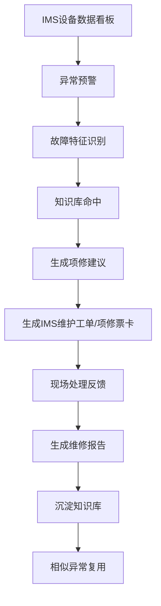

对，应该再收敛。

这个 demo 不需要体现“关联系统能力”，更不需要演成 IMS、HSE、供应链多系统协同。否则范围会失控，也不符合立项 demo 的目标。

更准确的定位应该是：

```text
本次 demo = 部署在 IMS 里的智能运维演示模块

只演示：
1. IMS 内部如何接收 / 展示设备异常
2. 如何把异常数据转成故障特征
3. 如何通过知识库给出诊断依据和处置建议
4. 如何生成 IMS 内部的维护工单 / 项修票卡
5. 如何记录现场反馈
6. 如何生成报告并沉淀到知识库
7. 如何在下一次相似异常中复用
```

HSE 和供应链在 demo 里最多只作为“字段占位”或“后续可扩展项”：

```text
HSE：不演示票证办理，只在工单中保留“安全凭证状态/待办理”字段。
供应链：不演示采购流程，只在工单中保留“备件需求/库存状态”字段。
```

主线建议压缩成：



这样业务价值仍然完整：

```text
看得见异常
说得清原因
找得到依据
给得出处置
留得下记录
形成报告
下次能复用
```

这比“多系统联动”更适合 demo，也更容易 15 天内稳定交付。

建议你对业务方这样定边界：

> 本次 demo 先聚焦 IMS 内部智能运维闭环，不做 HSE、供应链等外部系统联动；外部系统只保留字段和扩展入口。先把异常识别、知识库诊断、项修票卡、工单反馈、报告沉淀、经验复用这条闭环演顺，保证立项展示效果。