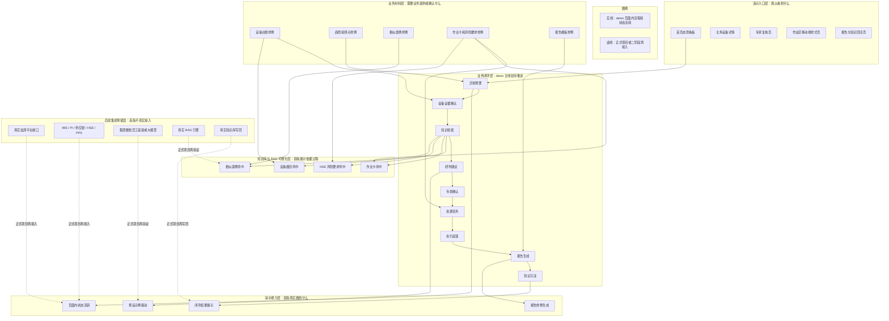

# 输油泵智能运维助手（"泵智护"）demo 需求澄清与方案选型稿

> 文档性质：业务方讨论稿 / demo 范围选择材料
> 使用场景：用于立项 demo 前和业务方一起确认“演什么、做到什么深度、需要准备什么”
> 核心原则：不替业务方拍板，而是把可行方案、演示效果、边界和材料依赖讲清楚，让业务方选择
> 不适用：本文不是开发详设、不是报价单、不是真实系统集成方案

---

## 1. 当前理解

结合申报材料、业务流程图和沟通反馈，我们对当前 demo 诉求的理解如下：

```text
业务方不希望做成大而全平台。
业务方希望 demo 用于项目立项。
业务方希望看到完整业务闭环，而不是单页展示。
业务方关心数智员工、RAG、企业知识库如何参与流程。
业务方不希望 demo 是黑盒，希望看到依据、过程和效果。
业务方当前不要求首版接入真实 AI，也不要求接生产系统。
```

因此，demo 的重点应从“技术能力堆叠”调整为“业务闭环演示 + 知识依据可见 + 工程边界可选”。

```text
不是重点：
  真实大模型 API 是否已接入
  是否本地部署模型
  是否真实打通生产系统
  是否训练诊断模型

真正重点：
  业务场景是否清楚
  流程是否能闭环
  数智员工为什么这样建议是否可解释
  企业知识库 / RAG 是否在流程中可见
  演示是否稳定、可控、适合立项
```

## 2. demo 成败判据

建议把立项 demo 的成败判据定义为：

```text
观众在 8-12 分钟内能否看懂：

1. 这套系统解决什么运维痛点
2. 一台泵机组异常后流程如何闭环
3. 数智员工不是黑盒，而是基于知识和案例辅助判断
4. 企业知识库不是静态资料库，而是参与诊断、处置和沉淀
5. 首版 demo 范围可控，后续正式项目有扩展路径
```

## 3. 业务主场景选择

业务材料里出现了多个场景：集中监测诊断、日常巡检、计划性维护保养、项修、大修。首版 demo 不建议全部做成完整交互流程，而应选一个主场景做深，其他场景作为扩展入口说明。

| 选项 | 主场景 | 演示效果 | 适合程度 | 风险 |
|---|---|---|---|---|
| A | 集中监测诊断闭环 | 异常预警 -> 数智员工研判 -> 专家复核 -> 处置 -> 报告 -> 知识沉淀 | **条件推荐首版**。若能准备异常趋势、相似案例、作业依据和报告样例，最能体现智能运维和立项价值 | 需要准备一条完整异常事件素材 |
| B | 日常巡检发现问题闭环 | 巡检发现问题 -> 记录 -> 排查 -> 处置 -> 经验沉淀 | 适合体现作业区移动端和现场管理 | 预警、诊断、数智员工价值不如 A 强 |
| C | 计划性维护保养闭环 | 年度计划 -> 作业准备 -> 保养执行 -> 报告 -> 知识沉淀 | 适合体现标准化作业和知识库 | 缺少“异常触发”的戏剧张力 |
| D | 项修 / 大修闭环 | 方案建议 -> 审批 -> 物料 -> 作业 -> 报告 -> 知识沉淀 | 适合体现复杂检维修流程 | 素材多、流程长，不适合首版立项 demo |

建议业务方先选择：

```text
Q1：首版主场景是否选择“集中监测诊断闭环”？
Q2：业务方能否提供或确认该场景所需的异常趋势、相似案例、作业依据和报告样例？
Q3：其他场景是否只作为首页业务地图和后续扩展入口展示？
```

## 4. 推荐主线骨架

若选择“集中监测诊断闭环”，建议 demo 主线为：

```text
泵机组出现异常趋势
  -> 监视中心收到预警事件
  -> 进入主角设备详情页
  -> 展示测点、趋势和异常说明
  -> 数智员工触发研判
  -> 企业知识库 / RAG 检索相似案例和标准作业依据
  -> 生成排查建议和处置建议
  -> 专家复核确认
  -> 演示作业卡、工单、备件、票证、异常事件记录关系
  -> 作业区移动端样式页提交反馈
  -> 生成异常事件分析报告示例
  -> 展示报告内容回流知识库 / 一机一档的效果
```

这条主线要让业务方看到：

```text
异常不是凭空出现的：
  有设备、有测点、有趋势。

建议不是凭空生成的：
  有知识库、有案例、有标准作业依据。

闭环不是口头说的：
  有状态流转、有专家确认、有处置反馈、有报告、有沉淀效果。
```

说明：首版只演示页面内业务关系和状态变化，不代表真实接口联通、真实系统写回或生产系统集成。

## 5. 单条 demo 闭环样例

本节先给出一条可以直接拿给业务方讨论的 demo 样例。它不是最终需求，而是“讨论骨架”：业务方可以在每个节点上增删关心的要素，最后形成明确的演示范围。

### 5.1 闭环总览

```text
场景名称：
  某站输油泵出现异常趋势后的智能诊断与处置闭环

演示目标：
  让观众看到一台泵机组从“异常被发现”到“处置完成、报告生成、知识沉淀”的全过程。

首版边界：
  不接真实 AI。
  不接生产系统。
  不写入真实知识库。
  用可交互页面、预设示例和可视化依据证明业务闭环成立。
```

```text
首页态势
  -> 异常预警
  -> 设备证据
  -> 知识检索
  -> 数智员工研判
  -> 专家复核
  -> 处置任务
  -> 作业反馈
  -> 报告生成
  -> 知识回流
```

### 5.2 节点输入输出

标记说明：

```text
[交互] demo 页面内真实可点击、状态可变化。
[预设] 结果由演示素材预先准备，不代表真实 AI 推理。
[示意] 展示业务关系或页面效果，不代表真实系统接入、同步或写回。
[预留] 首版不做，作为正式项目或二阶段验证入口。
```

| 节点 | 业务动作 | 输入 | demo 页面展示 | 输出 | 下一步 | 首版标记 |
|---|---|---|---|---|---|---|
| 0 | 首页进入主场景 | 设备台账样例、站场/设备列表、健康状态样例 | 首页态势看板，显示“1 台重点关注设备” | 选中主角设备 | 点击进入预警事件 | [交互] |
| 1 | 异常预警触发 | 主角设备、测点示意、72 小时趋势样例、预警事件样例 | 风险卡片、趋势曲线、测点位置高亮、异常说明 | 预警事件 | 进入设备详情 | [交互] [预设] |
| 2 | 查看设备证据 | 预警事件、设备一机一档、趋势数据、历史维护摘要 | 设备详情页：基础信息、测点趋势、异常时间轴、历史记录摘要 | 待研判对象 | 触发数智员工研判 | [交互] [预设] |
| 3 | 企业知识库检索 | 待研判对象、故障案例样例、作业卡样例、HSE 风险要求样例、设备履历样例 | “检索中 -> 命中结果”：相似案例、作业依据、风险要求、设备履历 | 知识依据包 | 生成研判建议 | [交互] [预设] |
| 4 | 数智员工研判 | 知识依据包、异常现象、设备履历 | 疑似原因、排查步骤、建议作业卡、需要专家确认的问题 | 初步研判建议 | 专家复核 | [交互] [预设] |
| 5 | 专家复核确认 | 初步研判建议、知识依据、趋势证据 | 专家端示例页：确认/调整结论，补充备注 | 已确认诊断结论 | 生成处置任务 | [交互] |
| 6 | 处置任务编排 | 已确认诊断结论、作业卡、备件样例、票证样例、异常事件记录样例 | 工单卡片、作业卡、备件需求、HSE 票证、PPS 异常事件关系图 | 待执行处置任务 | 作业区反馈 | [交互] [示意] |
| 7 | 作业区执行反馈 | 待执行处置任务、现场反馈样例、处理结果样例 | 移动端样式页：接收任务、查看作业卡、提交处理结果 | 处置反馈记录 | 生成报告 | [交互] [示意] |
| 8 | 异常事件报告生成 | 预警、趋势、知识依据、专家结论、处置反馈 | 报告预览：原因分析、排查过程、处理措施、引用依据、专家结论 | 异常事件分析报告样例 | 知识回流 | [交互] [预设] |
| 9 | 知识回流与闭环 | 报告样例、处置结果、专家确认结论 | 知识库新增案例、一机一档更新字段、闭环状态变为“已完成” | 新案例样例、设备履历更新效果 | 回到首页展示风险关闭 | [交互] [示意] |

### 5.3 业务方可增删的讨论点

业务方讨论时不需要先讨论技术实现，可以逐个节点确认“要不要演、演到什么程度”：

| 节点 | 需要业务方判断 | 推荐默认 |
|---|---|---|
| 异常预警 | 异常来自监测平台、巡检上报，还是人工创建演示事件 | 推荐监测预警触发，更贴合智能运维 |
| 设备证据 | 是否需要展示真实测点图、趋势图、设备履历 | 推荐展示测点图 + 趋势 + 简化履历 |
| 知识检索 | 是否必须体现 RAG / 企业知识库 | 推荐必须体现，但首版做检索过程可视化 |
| 数智员工研判 | 是否需要现场自由问答 | 推荐不做自由问答，只做固定研判流程 |
| 专家复核 | 是否需要专家角色参与 | 推荐保留，增强可信度和业务闭环 |
| 处置任务 | 是否要展示备件、HSE、PPS、IMS 的关系 | 推荐展示关系，不做真实系统对接 |
| 作业反馈 | 是否需要移动端 | 推荐做移动端样式页，不做原生 App |
| 报告生成 | 是否要一键生成报告 | 推荐要，这是演示高潮点 |
| 知识回流 | 是否要展示知识库新增 | 推荐要，体现“可进化”和闭环收尾 |

### 5.4 这条主线解决的业务痛点

| 业务痛点 | demo 中如何体现 | 对应节点 |
|---|---|---|
| 异常发现后缺少连续证据 | 用趋势、测点、时间轴说明异常不是孤立告警 | 节点 1-2 |
| 诊断依赖个人经验 | 展示企业知识库命中案例和作业依据 | 节点 3-4 |
| 数智员工建议容易被认为是黑盒 | 每条建议旁边展示引用依据和相似案例 | 节点 3-4 |
| 处置过程跨系统、容易断链 | 用页面内状态流转展示工单、作业卡、备件、票证、异常事件关系 | 节点 6-7 |
| 处理后经验没有沉淀 | 报告生成后展示案例库和一机一档更新效果 | 节点 8-9 |

### 5.5 演示时长建议

```text
0:00 - 1:00   首页态势和主角设备
1:00 - 2:30   异常预警、趋势和测点证据
2:30 - 4:30   企业知识库检索和依据可视化
4:30 - 6:00   数智员工研判与专家复核
6:00 - 8:00   作业卡、工单、备件、票证、反馈闭环
8:00 - 10:00  报告生成和知识回流
```

## 6. 首版 demo 分层架构与演示边界（非真实集成）

这张图用于向业务方说明：首版 demo 的目标是跑通业务闭环和展示知识依据，不是一次性建设生产系统。



分层理解如下：

| 层级 | 首版 demo 做什么 | 首版不做什么 |
|---|---|---|
| 演示入口层 | 做可点击页面，让观众看到完整流程 | 不做生产级门户 |
| 业务闭环层 | 做一条主线流程，状态能从开始走到结束 | 不做所有场景全量闭环 |
| 演示能力层 | 做页面内状态变化、依据展示、报告样例、知识回流效果 | 不做真实 AI 推理、不做真实系统写回 |
| 知识库与 RAG 可视化层 | 展示“命中了哪些案例、作业卡、风险要求、设备履历” | 不做真实 RAG 检索效果验证 |
| 业务材料层 | 用业务确认过的样例支撑演示可信度 | 不要求一开始拿到完整生产数据 |
| 后续集成预留层 | 在架构上保留未来接入位置 | 首版不承诺真实接口、真实 RAG、真实大模型 |

对业务方可以这样解释：

```text
首版 demo 先证明“这条业务闭环值得立项”。
页面上的状态、依据、报告和知识回流都可以交互展示。
但真实 AI、真实接口、真实知识库写回属于正式项目或二阶段验证，
不作为首版立项 demo 的前提。
```

## 7. RAG / 企业知识库展示深度选择

业务方提到想了解 RAG、企业知识库，这一项应进入 demo 流程，而不是只写在架构里。

### 7.1 业务化解释

在本 demo 中，RAG / 企业知识库不建议先讲成技术名词，而应讲成：

```text
数智员工不是黑盒回答，
而是先从企业知识库中找依据，
再基于这些依据给出排查建议和报告内容。
```

知识库可以包含：

```text
历史故障案例
标准作业卡
检维修指导书
异常事件分析报告
设备一机一档履历
专家经验
HSE 作业风险要求
备件 / 物料要求样例
```

### 7.2 可选方案

| 选项 | 展示方式 | 演示效果 | 可行性 | 适用建议 |
|---|---|---|---|---|
| A | 静态知识库展示 | 页面展示案例库、作业卡、报告模板 | 稳定，成本低 | 可作为基础，但 AI 感和解释性不足 |
| B | 知识检索过程可视化 | 异常发生后展示“命中 3 条相似案例、2 条作业卡、1 条风险要求” | **推荐首版**。不必真实接 AI，也能体现 RAG 思路 | 最适合立项 demo |
| C | 真实 RAG + 大模型生成 | 真实检索知识库并调用模型生成回答 | 技术真实度高 | 放立项后专项验证，首版风险较高 |

建议首版选择 B：

```text
把 RAG 做成“可看见的知识检索过程”，
而不是后台黑盒。
```

### 7.3 demo 中的展示节点

```text
节点 1：预警后
  数智员工显示：
    正在检索企业知识库...

节点 2：检索结果
  命中：
    相似案例 3 条
    标准作业卡 2 条
    HSE 风险要求 1 条
    设备履历 1 条

节点 3：生成建议
  基于上述依据生成：
    疑似原因
    排查步骤
    建议作业卡
    专家复核说明

节点 4：报告生成
  报告中标注：
    参考案例
    参考作业卡
    排查过程
    处置结论

节点 5：知识回流
  本次处置结果形成：
    新增案例样例
    一机一档更新效果
    知识库沉淀效果
```

### 7.4 可见证据要求

为避免 demo 变成“数智员工黑盒结论”，建议首版至少展示以下证据：

```text
每条排查建议：
  至少展示 1 条相似案例摘要
  至少展示 1 条作业依据编号或标题
  至少展示 1 条设备履历或测点依据

每份报告示例：
  至少标注 1 处参考案例来源
  至少标注 1 处参考作业依据
  至少展示排查过程和专家确认结论

每次知识回流：
  至少展示新增案例摘要
  至少展示一机一档更新字段
  至少展示知识库新增效果
```

## 8. AI 接入方式选择

业务已明确当前 demo 不以真实 AI 接入为前提。因此 AI 应分成“演示效果”和“真实接入”两件事讨论。

| 选项 | AI 方式 | 演示效果 | 风险 | 建议 |
|---|---|---|---|---|
| A | 不接真实 AI，使用预设示例驱动 | 数智员工可展示分析、检索依据、建议和报告示例 | 稳定，可控 | **推荐首版** |
| B | 接外部 AI API | 可现场生成部分解释和报告文本 | 网络、合规、输出稳定性风险 | 不作为首版前提 |
| C | 接集团数智员工底座 / 私有化模型 | 更贴合集团路线 | 需要账号、权限、接口、内网环境 | 如业务方明确要求，可单独确认 |
| D | 本地化部署模型 | 不依赖外网 | 部署重、算力和调试成本高 | 不建议立项 demo 首版 |

建议会上的讨论问题：

```text
AI-1：首版是否确认“不接真实 AI，也能演示数智员工效果”？
AI-2：是否需要在页面上体现“未来可接集团数智员工底座”的位置？
AI-3：是否要求本次 demo 现场真实生成内容，还是接受预设示例生成？
```

## 9. demo 功能深度选择

| 功能 | A 档：页面展示 | B 档：可交互闭环【推荐】 | C 档：半真实集成 |
|---|---|---|---|
| 首页态势 | 展示数字和设备列表 | 可点击进入风险设备 | 接真实设备台账 |
| 异常预警 | 展示预警结果 | 可播放 72 小时趋势回放 | 接实时监测数据 |
| 知识库 / RAG | 展示知识库页面 | 可视化展示知识命中和依据 | 真实 RAG 检索 |
| 数智员工 | 展示建议文本 | 点击触发研判、排查、报告示例 | 接真实模型 / 平台 |
| 专家复核 | 展示专家结论 | 点击确认后状态流转 | 接真实审批流程 |
| 作业处置 | 展示作业卡和工单 | 状态从待处理到已反馈 | 接 IMS / HSE / PPS |
| 报告生成 | 展示报告样例 | 点击生成报告示例 | 接真实报告系统 |
| 知识沉淀 | 展示知识库 | 展示新增效果 | 写入真实知识库 |

建议首版选择 B 档：

```text
不是静态页面，
也不是正式系统，
而是可交互、可控、可稳定演示的首版演示版。
```

说明：本表中的 B 档只表示“页面内可交互、状态可变化、依据可查看”，不代表真实接口联通、真实系统写回或生产系统集成。

## 10. 演示素材包选择

为了让 demo 不像空页面，需要准备一套“业务演示素材包”。这不是技术数据表，而是支撑故事的业务材料。

| 素材 | 用途 | 业务方需要提供或确认 |
|---|---|---|
| 主角设备 | 说明问题发生在哪台泵 | 站场、设备编号、设备类型、测点示意 |
| 异常事件 | 触发 demo 主线 | 异常振动 / 监测预警 / 巡检发现问题三选一 |
| 异常趋势 | 说明为什么预警 | 72 小时趋势样例，允许演示构造但需业务认可 |
| 测点示意 | 让异常位置可视化 | 可使用业务补充的泵机组仪表点位图思路 |
| 相似案例 | 支撑知识检索 | 1-3 条脱敏故障或异常处理案例 |
| 标准作业依据 | 支撑处置建议 | 作业卡、指导书、风险要求样例 |
| 处置流程样例 | 支撑闭环 | 工单、备件、票证、异常事件记录样例 |
| 报告样例 | 支撑报告生成 | 异常事件分析报告或预防性建议报告模板 |
| 知识沉淀样例 | 支撑回流效果 | 案例库新增、一机一档更新、知识库新增效果 |

建议会上的讨论问题：

```text
M-1：业务方能否提供真实脱敏素材？
M-2：如果暂时无法提供，是否接受由技术方构造演示素材，并由业务专家确认“符合业务逻辑”？
```

## 11. 首版推荐组合

基于“立项 demo、稳定演示、不接真实 AI、不做大而全”的前提，建议首版组合为：

```text
主场景：
  集中监测诊断闭环

业务入口：
  一台泵机组异常振动 / 异常趋势预警

闭环范围：
  预警
    -> 知识检索依据可视化
    -> 数智员工研判
    -> 专家复核
    -> 作业处置关系展示
    -> 移动端反馈样式页
    -> 报告示例生成
    -> 知识库 / 一机一档新增效果

RAG / 企业知识库：
  做“检索依据可视化”
  不做真实 RAG 引擎

AI：
  不接真实 AI
  使用预设示例驱动呈现数智员工效果

系统接口：
  不接生产系统
  在页面内展示 IMS / PI / 供应链 / HSE / PPS 的业务关系，不代表真实接口联通

演示方式：
  可交互业务闭环演示版
  8-12 分钟演示
  准备演示备份
```

说明：首版推荐组合只承诺演示页面内的业务关系、状态变化和知识依据，不承诺真实生产系统写入、真实 AI 接入或真实接口集成。

## 12. 需要业务方确认的问题

### 12.1 本次必须确认的 3 项

| 编号 | 需要确认 | 选项 | 建议 |
|---|---|---|---|
| Q1 | 主场景 | 集中监测诊断 / 日常巡检 / 维护保养 / 项修大修 | 推荐集中监测诊断 |
| Q2 | RAG / 企业知识库展示深度 | 静态知识库 / 检索过程可视化 / 真实 RAG | 推荐检索过程可视化 |
| Q3 | 演示素材来源 | 业务方提供 / 技术方构造后业务确认 / 混合 | 推荐混合，关键素材需业务确认 |

### 12.2 其余按默认建议推进

| 事项 | 默认建议 |
|---|---|
| 其他业务场景 | 首页业务地图展示，不做完整交互 |
| AI 接入 | 首版不接真实 AI，页面内展示数智员工效果 |
| 报告生成 | 点击生成报告示例 |
| 知识回流 | 展示新增效果，不写入真实库 |
| 系统接口 | 不接生产系统，仅展示页面内业务关系 |
| 演示形态 | 可交互业务闭环演示版 |
| 验收口径 | 8-12 分钟内跑通主线，RAG 依据可见，报告和知识回流效果可见 |

## 13. 会上收口话术

```text
这次 demo 我们建议不先做大而全，也不先验证真实 AI 接入。

首版先围绕一个主场景：
  泵机组集中监测诊断闭环。

重点不是让数智员工“像聊天机器人一样回答”，
而是让业务方和领导看到：
  异常发生后，
  系统如何找到知识依据，
  如何辅助研判，
  如何推动处置，
  如何生成报告，
  如何沉淀知识。

RAG / 企业知识库建议在 demo 中做成可视化过程：
  看得见检索了哪些案例，
  看得见引用了哪些作业依据，
  看得见这些依据如何支撑排查建议和报告。

业务方需要选择的是：
  主场景选哪个，
  RAG 展示到什么深度，
  演示素材由谁提供并由谁确认。

其余工程边界建议按默认口径推进：
  首版不接真实 AI，
  不接生产系统，
  不写入真实知识库，
  先证明业务闭环和知识依据可见。
```
