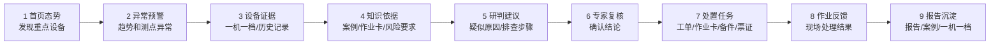

# 输油泵智能运维助手 demo 骨架讨论版

> 用途：业务会讨论稿，用于快速确认首版 demo “演什么、看到什么、边界到哪里”。
> 结论口径：本材料用于评估 demo 骨架，不代表生产集成方案。

---

## 1. 一句话目标

首版 demo 面向立项评审和业务领导，建议只证明一件事：

```text
一台输油泵出现异常趋势后，
系统能把“发现异常 -> 找依据 -> 辅助研判 -> 推动处置 -> 生成报告 -> 沉淀经验”
完整演示出来。
```

首版不追求“大平台全景”，先把一条闭环讲顺。

## 2. 视角一：演示主线总览

这张图回答：**观众 8-10 分钟会看到什么？**



推荐主线：**集中监测诊断闭环**。

其他场景，如日常巡检、维护保养、项修、大修，首版只做入口或口头说明，不做完整流程。

业务补充流程图与本 demo 的关系：

| 业务补充图 | 在首版 demo 中的定位 | 用法 |
|---|---|---|
| 泵机组集中监测诊断管理 | **主线参考** | 作为首版完整闭环来源：预警、诊断、复核、处置、报告、知识回流 |
| 泵机组日常巡检管理 | 扩展场景 | 首页可作为“其他业务场景”入口，不做完整流程 |
| 泵机组计划性维护保养（4K） | 扩展场景 | 用于说明后续可扩展到计划性维护，不做首版主线 |
| 泵机组项修 | 扩展场景 | 用于说明后续可扩展到项修流程，不做首版主线 |
| 泵机组大修 | 扩展场景 | 流程长、审批和物料环节多，首版不展开 |
| 输油泵机组仪表点位 | 页面素材 | 用在设备详情页，展示异常测点和趋势证据 |

## 3. 视角二：页面和功能骨架

这部分回答：**demo 需要哪些页面，每页证明什么？**

```text
首页态势看板
  证明：能发现重点关注设备

设备详情页
  证明：异常有设备、测点、趋势和历史记录支撑
  可使用：输油泵机组仪表点位图，高亮异常测点

知识依据页
  证明：建议不是黑盒，有案例、作业卡、风险要求作依据

研判与复核页
  证明：数智员工给建议，专家做确认

处置闭环页
  证明：工单、作业卡、备件、票证、反馈之间有关联

报告沉淀页
  证明：处理结果能形成报告，并沉淀到案例库 / 一机一档效果中
```

页面不求多，关键是每页都服务这条主线。

## 4. 视角三：闭环输入输出

这部分回答：**每一步需要什么素材，产生什么演示效果？**

| 阶段 | 输入素材 | 页面效果 | 输出 |
|---|---|---|---|
| 异常发现 | 设备样例、测点图、趋势样例 | 某泵变成重点关注设备 | 预警事件 |
| 证据确认 | 一机一档、历史记录、趋势 | 说明异常不是孤立告警 | 待研判对象 |
| 找知识依据 | 相似案例、作业卡、风险要求 | 展示命中哪些依据 | 知识依据包 |
| 辅助研判 | 知识依据包、异常现象 | 给出疑似原因和排查步骤 | 初步结论 |
| 专家复核 | 初步结论、依据、趋势 | 专家确认或调整 | 确认结论 |
| 处置流转 | 工单、作业卡、备件、票证样例 | 展示处置关系和状态变化 | 待执行任务 |
| 反馈报告 | 处理结果、报告模板 | 生成报告，展示沉淀效果 | 闭环完成 |

这些输入不是要求业务方立刻提供生产数据，而是需要业务方确认：演示素材是否符合真实业务逻辑。

## 5. 视角四：RAG / 企业知识库怎么体现

这部分回答：**业务关心的 RAG 和知识库，首版到底怎么演？**

首版只展示业务可见的三件事：

```text
1. 知识来源可见
   页面展示命中的相似案例、作业卡、HSE 风险要求、设备履历。

2. 引用依据可见
   每条研判建议旁边能看到“参考了哪些依据”。

3. 沉淀效果可见
   报告完成后，页面展示新增案例和一机一档更新效果。
```

首版建议：

| 项目 | 首版做法 |
|---|---|
| RAG | 做“知识命中过程可视化” |
| 企业知识库 | 用业务确认过的案例、作业卡、报告样例做演示素材 |
| AI 问答 | 不做开放式自由问答 |
| 真实检索 | 不作为首版前提 |
| 真实写回 | 不写入生产知识库，只展示回流效果 |

## 6. 视角五：工程边界

这部分回答：**哪些是首版 demo，哪些不是？**

| 类别 | 内容 | 首版口径 |
|---|---|---|
| 业务侧已有或需确认 | 设备样例、趋势样例、案例、作业卡、报告模板 | 业务提供或确认其合理性 |
| 本次 demo 模拟 | 趋势数据、预警事件、知识命中、研判建议、报告样例 | 用演示素材驱动，保证稳定演示 |
| 本次 demo 真实交互 | 页面点击、状态变化、流程推进、报告预览、回流效果展示 | 页面内真实可操作 |
| 后续可接入 | 监测平台、IMS、PI、HSE、PPS、供应链、集团数智员工底座、真实 RAG | 正式项目或二阶段再验证 |
| 本次不包含 | 真实 AI 接入、生产系统接口、真实工单下发、真实票证办理、真实知识库写回 | 不作为首版立项 demo 范围 |

建议会议结论中直接写明：

```text
首版 demo 是可交互业务闭环演示，
不是生产系统集成，
不承诺真实 AI、真实接口、真实写回。
```

## 7. 本次只需要业务拍板 5 件事

| 编号 | 拍板项 | 推荐默认 |
|---|---|---|
| Q1 | 主线是否选“集中监测诊断闭环” | 是 |
| Q2 | 是否必须展示企业知识库 / RAG | 是，展示知识命中和引用依据 |
| Q3 | 是否接受首版不接真实 AI | 接受，先保证稳定演示 |
| Q4 | 是否接受首版不接真实生产系统 | 接受，只展示业务关系和页面内状态 |
| Q5 | 演示素材怎么准备 | 业务提供关键样例，技术方补齐，业务确认合理性 |

这 5 项确认后，首版 demo 骨架即可冻结。

## 8. 业务方可补充的内容

请业务方只围绕这条主线补充，不要先扩展成多个完整场景：

```text
异常场景是否选得对？
哪些知识依据必须出现？
哪些系统关系必须露出？
专家复核是否保留？
报告里必须有哪些栏目？
知识回流展示到案例库，还是也要展示一机一档？
```

讨论原则：

```text
先定主线。
再定页面。
再定素材。
最后才讨论真实 AI 和真实系统接口。
```
