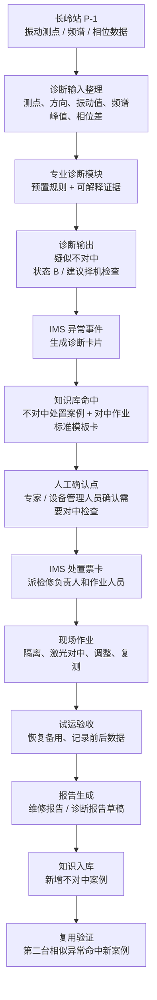
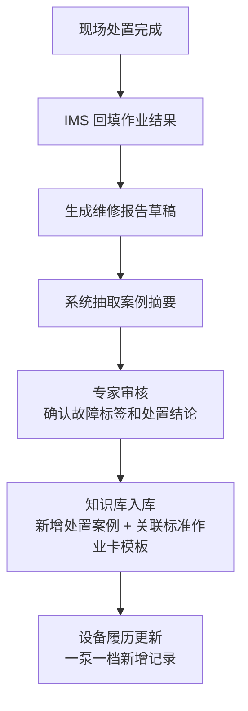

# 输油泵智能运维助手 demo：长岭 P-1 不对中诊断闭环报告

> 文档用途：把业务方补充的长岭 P-1 检测报告和对中作业卡，转成 demo 可用的“模型诊断输入 / 输出、业务流转、知识入库、知识复用”闭环。  
> 使用方式：先拿本文和业务方确认数据口径、阈值口径、作业卡适用性，再据此构造 demo 演示数据和页面流程。  
> 依据材料：`P1/湖南公司长岭站P-1输油泵机组状态检测与评估报告.docx`、`P1/04-ZLMI400 07型鲁尔输油泵对中作业卡.doc`。

---

## 1. 先给结论

业务方这次补充的 P1 材料，已经可以支撑一个更具体、更像业务真实场景的 demo 主线：

```text
长岭站 P-1 振动 / 频谱异常
  -> 演示规则识别“疑似不对中风险”
  -> IMS 命中“输油泵对中作业标准模板卡（待业务确认适配）”
  -> 分派检修人员执行对中检查 / 调整
  -> 回填对中结果和试运验收
  -> 生成维修报告
  -> 入库为不对中案例
  -> 第二台相似异常再次命中该经验
```

这条主线比“泛泛的振动高高报”更适合当前材料，因为它有三类关键证据：

| 证据 | 已有材料 | demo 价值 |
|---|---|---|
| 诊断输入 | 25 个振动测点、振动有效值、频谱主频、相位差、状态分级 | 可以构造“模型诊断入参” |
| 诊断输出 | 报告明确判断“机组存在不对中情况”，建议检查对中 | 可以构造“模型诊断出参” |
| 业务处置 | 对中作业卡包含许可、JSA、工具材料、作业步骤、验收签字 | 可以构造“IMS 处置票卡闭环” |

但这只能支撑 **演示态闭环**，不能宣称已经具备真实在线模型诊断能力。原因是：材料没有原始时域波形、没有完整时序趋势、没有温度 / 流量 / 压力数据、没有真实处置后的前后对比数据，也没有明确说明作业卡与长岭 P-1 设备完全匹配。

推荐首版 demo 改成：

```text
主故障：不对中
主设备：长岭站 P-1 输油泵机组
主动作：对中检查 / 对中调整
主闭环：诊断 -> 作业卡 -> 现场处置 -> 报告 -> 知识复用
```

---

## 2. 业务心智模型

这条 demo 不是要证明“AI 已经能自动修泵”，而是要证明：

```text
离散的振动和频谱信号
  能被系统转成可理解的故障特征；
故障特征
  能被系统转成 IMS 内可执行的作业卡；
作业完成后的记录
  能沉淀成知识；
后续相似问题
  能复用这次经验。
```

所以演示重点不是“模型多先进”，而是：

```text
数据有证据
诊断有依据
处置有票卡
现场有反馈
报告有沉淀
下次能复用
```

---

## 3. P1 材料能支撑什么

### 3.1 检测报告能支撑“模型诊断输入 / 输出”

`湖南公司长岭站P-1输油泵机组状态检测与评估报告` 可支撑以下 demo 内容：

| 类别 | 可用内容 |
|---|---|
| 设备 | 长岭站 P-1，投用时间 2008.6，电机南阳防爆，型号 `YB2-560M2-2W`，功率 70KW；泵厂家湖南天一奥星泵业，型号 `KSY900-225`，扬程 225m，排量 900m3/h |
| 测点 | 25 个测点，覆盖电机两端、泵两端、基础 / 地脚，包含水平、垂直、轴向、斜 45° |
| 振动值 | 电机测点 0.50-2.40mm/s，泵测点 1.36-2.62mm/s，最大值表格显示为泵驱动端垂直 2.62mm/s |
| 状态分级 | A：v<2.3；B：2.3<=v<4.5；C：4.5<=v<7.1；D：7.1<=v |
| 频谱证据 | 49.7Hz、100.3Hz、约 298-299Hz 等峰值；100.3Hz 可解释为约 2X 转频 |
| 相位证据 | 电机 / 泵驱动端相位约 90°；电机驱动端水平 / 垂直约 150°；泵驱动端水平 / 垂直约 150° |
| 诊断结论 | “判断机组存在不对中情况。建议择机检查机组对中情况。” |
| 附带建议 | 检查地脚螺栓及进出口管道固定情况；关注流量变化和工况点偏离 |

### 3.2 对中作业卡能支撑“业务处置闭环”

`04-ZLMI400 07型鲁尔输油泵对中作业卡` 可支撑以下 demo 内容：

| 流程节点 | 可用内容 |
|---|---|
| 派工 | 检修负责人、检修作业人员、监护 / 运行人 |
| 作业许可 | 是否办理作业许可、专项许可、JSA 分析、高风险作业判断 |
| 安全措施 | 切断流程、泄压、断电、接地、围栏、消防、防爆工具、急救设施等 |
| 工具材料 | 安全帽、防静电服、安全鞋、撬棍、扳手、游标卡尺、调整垫片、清洗剂、清洁布、四合一气体检测仪、激光对中仪、对讲机 |
| 作业步骤 | 记录检修前振动值和轴承温度、能量隔离、阀门隔离、激光对中测量、查看对中结果、调整电机和垫片、复测、恢复备用 |
| 验收 | 外观、完好、性能、安全防护、操作能力、相关系统、变更识别、安全环保、工完料尽场地清、签字确认 |
| 知识沉淀 | 对中测量结果、调整记录、前后振动 / 温度、验收结论、负责人签字、报告附件 |

### 3.3 当前材料的关键矛盾

需要业务方确认一个重要问题：

```text
检测报告里的长岭 P-1 泵型号是 KSY900-225；
对中作业卡名称是 ZLMI400/07 型鲁尔输油泵对中作业卡。
```

这两个材料能否在 demo 中作为同一条业务主线使用，必须由业务方确认。

推荐口径：

```text
如果业务方确认“对中作业卡可作为输油泵对中类标准作业卡模板”，
则首版 demo 可以继续使用它。

如果业务方要求设备型号严格一致，
则需要补充长岭 P-1 对应型号的正式对中作业卡。
```

---

## 4. 推荐 demo 主线

### 4.1 一句话主线

```text
长岭 P-1 检测发现不对中特征，IMS 将“疑似不对中风险”转成对中作业标准模板卡【待业务确认适配】，现场完成对中检查 / 调整后形成报告，并沉淀为后续相似异常可复用的知识案例。
```

### 4.2 流程图



### 4.3 演示时的讲解节奏

| 步骤 | 业务方 / 评委看到什么 | 要证明什么 |
|---|---|---|
| 1. 设备进入风险列表 | 长岭 P-1 显示“频谱异常 / 不对中风险” | 系统能从设备列表定位风险 |
| 2. 展示测点图 | 25 个测点，高亮电机 / 泵驱动端、非驱动端、基础测点 | 异常不是一句话结论，有点位依据 |
| 3. 展示诊断输入 | 振动值、频谱峰值、相位差、状态分级 | 模型入参可解释 |
| 4. 输出诊断结论 | “疑似不对中”，附证据：2X 频谱、相位差、基础振动较大 | 模型输出不是黑盒 |
| 5. 命中知识库 | 命中“不对中历史案例”和“输油泵对中作业标准模板卡【待业务确认适配】” | 知识库参与决策 |
| 6. 生成处置票卡 | 派检修负责人、作业人员、运行监护人，列出许可 / JSA / 工具 / 步骤 | 诊断能推动业务动作 |
| 7. 现场反馈 | 填写对中结果、垫片调整、复测合格、恢复备用 | 现场处理形成闭环 |
| 8. 生成报告 | 自动组织检测依据、处置过程、验收结论、经验标签 | 减少人工写报告 |
| 9. 复用验证 | 第二台相似 2X 频谱 + 相位异常，命中长岭 P-1 案例 | 知识沉淀不是终点，可以复用 |

---

## 5. 模型诊断：输入怎么构造

首版 demo 不建议做真实模型训练。建议把“模型诊断”做成：

```text
预置规则 + 预置样例数据 + 可解释诊断卡片
```

也就是：输入字段看起来像真实监测数据，输出结果按材料中的诊断结论构造，页面上清楚展示依据。

### 5.1 设备输入

| 字段 | 示例值 | 来源 / 说明 |
|---|---|---|
| 站场 | 长岭站 | 检测报告 |
| 设备编号 | P-1 | 检测报告 |
| 设备类型 | 输油泵机组 | 检测报告 |
| 投用时间 | 2008.6 | 检测报告 |
| 电机厂家 | 南阳防爆 | 检测报告 |
| 电机型号 | YB2-560M2-2W | 检测报告 |
| 功率 | 70KW | 检测报告 |
| 电压 | 6000V | 检测报告 |
| 电流 | 86.4A | 检测报告 |
| 转速 | 2980r/min；频谱图中可按 3000r/min 展示 | 检测报告 / 频谱图 |
| 转频 | 50.00Hz | 频谱图 |
| 泵厂家 | 湖南天一奥星泵业 | 检测报告 |
| 泵型号 | KSY900-225 | 检测报告 |
| 扬程 | 225m | 检测报告 |
| 排量 | 900m3/h | 检测报告 |
| 轴承类型 | 滑动轴承 | 检测报告 |

### 5.2 测点输入

建议 demo 至少录入 7 个关键测点，不必把 25 个测点全部展开。

| 测点 | 振动值 mm/s | 频谱主频 | 诊断含义 |
|---|---:|---|---|
| 电机非驱动端水平 | 1.85 | 100.3Hz | 约 2X 转频，支撑不对中特征 |
| 电机驱动端水平 | 2.40 | 49.7Hz | 1X 成分明显 |
| 电机非驱动端斜 45° | 1.89 | 100.3Hz | 约 2X 转频，支撑不对中特征 |
| 泵驱动端水平 | 1.91 | 49.7Hz | 1X 成分明显，存在二倍频成分 |
| 泵驱动端垂直 | 2.62 | 49.7Hz | 最大振动点，状态进入 B 档 |
| 泵驱动端轴向 | 1.73 | 49.7Hz | 轴向测点参与不对中判断 |
| 泵非驱动端垂直 | 2.16 | 49.7Hz | 参与综合判断 |

基础测点建议作为辅助证据：

| 基础测点 | 振动值 mm/s | 诊断含义 |
|---|---:|---|
| 泵基础 E | 1.55 | 基础振动偏大 |
| 泵基础 F | 2.40 | 基础振动偏大 |
| 泵基础 G | 1.15 | 基础振动偏大 |
| 泵基础 H | 0.68 | 对照测点 |

### 5.3 阈值输入

检测报告中给出的状态分级：

| 等级 | 振动有效值 V |
|---|---|
| A | v < 2.3mm/s |
| B | 2.3 <= v < 4.5mm/s |
| C | 4.5 <= v < 7.1mm/s |
| D | 7.1 <= v |

业务方补充口径：

```text
7.1 可按停机值理解；
本次展示阈值按报警 / 停机值的 80% 设定。
```

建议把阈值拆成三类，不要混在一起讲：

| 口径 | 建议值 | demo 用法 |
|---|---:|---|
| 状态分级线 | A/B=2.3，B/C=4.5，C/D=7.1 | 解释检测报告为什么评为 B 档 |
| 演示预警线 | 5.68mm/s | 7.1 * 80%，仅用于趋势回放时展示“预警线” |
| 处置建单触发 | 不直接等同某个阈值 | 首版建议由“检测报告导入 + 不对中特征命中 + 人工确认”触发处置票卡 |

需要注意：

```text
P1 报告中的真实最大振动值是 2.62mm/s，属于 B 档，没有达到 5.68mm/s 演示预警线。

所以首版主叙事不要说“实时报警自动派工”，而要说：
检测报告导入后，系统识别不对中特征，生成“关注级诊断事件”，经专家 / 设备管理人员确认后生成处置票卡。

如果业务方坚持要演“报警触发”，需要额外构造一段演示趋势：
2.62 -> 4.6 -> 5.8 -> 处置后回落。

这段趋势应标注为“演示趋势 / 回放数据”，不能说是报告原始实测时序。
```

### 5.4 频谱和相位输入

| 输入类型 | 示例值 | 诊断用途 |
|---|---|---|
| 转频 | 50.00Hz | 判断 1X / 2X / 6X |
| 1X 峰值 | 49.7Hz | 旋转频率附近振动成分 |
| 2X 峰值 | 100.3Hz | 不对中常见判断证据之一 |
| 6X 成分 | 约 298-299Hz | 叶片通过频率，提示关注流量和工况点偏离 |
| 电机 / 泵驱动端相位差 | 约 90°，图片可见 -81.06° | 支撑不对中判断 |
| 电机驱动端水平 / 垂直相位差 | 约 150° | 支撑不对中判断 |
| 泵驱动端水平 / 垂直相位差 | 约 150° | 支撑不对中判断 |
| 相干性 / 相关性 | 0.95-0.99 | 支撑相位数据可信 |

---

## 6. 模型诊断：输出怎么构造

### 6.1 输出卡片

建议 demo 的模型诊断输出如下：

| 输出项 | 示例值 |
|---|---|
| 诊断对象 | 长岭站 P-1 输油泵机组 |
| 当前状态 | B，良 |
| 最大振动点 | 泵驱动端垂直，2.62mm/s |
| 主要诊断 | 疑似不对中 |
| 诊断等级 | 关注 / 建议择机处理 |
| 证据匹配分值 | 86/100【建议，演示值，非真实模型置信度】 |
| 证据 1 | 电机非驱动端水平、电机非驱动端斜 45°频谱以 100.3Hz 为主，约 2X 转频 |
| 证据 2 | 多个电机 / 泵测点存在二倍频成分 |
| 证据 3 | 电机 / 泵驱动端相位差约 90°，水平 / 垂直相位差约 150° |
| 证据 4 | 泵基础 E/F/G 振动偏大 |
| 附带发现 | 存在 6X 叶片通过频率成分，建议关注流量变化和工况点偏离 |
| 建议动作 | 命中输油泵对中作业标准模板卡【待业务确认适配】，择机检查机组对中情况；同步检查地脚螺栓及进出口管道固定情况 |

### 6.2 证据匹配分值怎么解释

`86/100` 不是材料原文中的真实模型分数，也不是生产模型置信度，建议只作为 demo 的“证据匹配分值”。页面上可以解释为：

```text
证据匹配分值 = 频谱证据 + 相位证据 + 测点分布 + 基础振动证据 + 人工确认状态
```

示例评分口径：

| 证据 | 分值 | 说明 |
|---|---:|---|
| 多测点存在 2X 成分 | 30 | 100.3Hz 约为 2X 转频 |
| 相位差符合不对中特征 | 30 | 90° / 150° 相位差作为强证据 |
| 振动状态进入 B 档 | 10 | 当前未严重超限，但已有关注信号 |
| 基础振动偏大 | 10 | E/F/G 基础振动偏大 |
| 待人工确认状态 | 6 | 表示需要专家 / 设备管理人员确认，不代表自动确诊 |
| 合计 | 86 | 演示值，需业务确认 |

### 6.3 模型入参 / 出参样例

后续构造 demo 数据时，可以按下面结构组织。

```json
{
  "asset": {
    "station": "长岭站",
    "asset_id": "P-1",
    "asset_type": "输油泵机组",
    "motor_model": "YB2-560M2-2W",
    "pump_model": "KSY900-225",
    "speed_rpm": 3000,
    "rotating_frequency_hz": 50.0
  },
  "event": {
    "event_id": "CL-P1-20250408-001",
    "snapshot_time": "2025-04-08 11:17:46",
    "data_origin": "检测报告导入",
    "event_trigger": "不对中特征命中 + 人工确认",
    "is_realtime_alarm": false
  },
  "thresholds": {
    "grade_a_max_mm_s": 2.3,
    "grade_b_max_mm_s": 4.5,
    "stop_value_mm_s": 7.1,
    "demo_warning_mm_s": 5.68
  },
  "measurements": [
    {
      "point_id": "M1H",
      "point": "电机非驱动端水平",
      "component": "电机",
      "side": "非驱动端",
      "direction": "水平",
      "velocity_rms_mm_s": 1.85,
      "main_peak_hz": 100.3,
      "harmonic": "2X",
      "data_origin": "检测报告"
    },
    {
      "point_id": "P1V",
      "point": "泵驱动端垂直",
      "component": "泵",
      "side": "驱动端",
      "direction": "垂直",
      "velocity_rms_mm_s": 2.62,
      "main_peak_hz": 49.7,
      "harmonic": "1X",
      "data_origin": "检测报告"
    }
  ],
  "trend_series": [
    {
      "time": "T0",
      "point": "泵驱动端垂直",
      "value_mm_s": 2.62,
      "data_origin": "检测报告"
    },
    {
      "time": "T+demo",
      "point": "泵驱动端垂直",
      "value_mm_s": 5.8,
      "data_origin": "演示回放"
    }
  ],
  "phase": [
    {
      "name": "电机/泵驱动端相位",
      "point_a": "电机驱动端",
      "point_b": "泵驱动端",
      "delta_deg": -81.06,
      "correlation": 0.97,
      "data_origin": "检测报告图片"
    },
    {
      "name": "电机驱动端水平/垂直相位",
      "point_a": "电机驱动端水平",
      "point_b": "电机驱动端垂直",
      "delta_deg": 150.08,
      "correlation": 0.99,
      "data_origin": "检测报告图片"
    }
  ]
}
```

```json
{
  "diagnosis": {
    "asset_id": "长岭站-P-1",
    "overall_status": "B",
    "status_text": "良",
    "fault_type": "疑似不对中",
    "diagnosis_level": "关注",
    "evidence_match_score": 86,
    "score_label": "演示证据匹配分，非真实模型置信度",
    "requires_manual_confirmation": true,
    "max_vibration_point": "泵驱动端垂直",
    "max_vibration_value_mm_s": 2.62,
    "evidence": [
      "电机非驱动端水平和斜45°测点频谱以100.3Hz为主，约2X转频",
      "多个电机/泵测点存在二倍频成分",
      "电机/泵驱动端相位差约90°，水平/垂直相位差约150°",
      "泵基础E/F/G振动偏大"
    ],
    "recommendation": [
      "择机检查机组对中情况",
      "检查地脚螺栓及进出口管道固定情况",
      "关注输油泵流量变化和工况点偏离"
    ],
    "matched_cards": [
      {
        "name": "输油泵对中作业标准模板卡",
        "card_match_status": "待业务确认适配"
      }
    ]
  }
}
```

---

## 7. 业务流转怎么嵌入 IMS

### 7.1 从诊断到派工

```text
检测报告 / 演示数据导入
  -> 诊断模块输出“疑似不对中风险”
  -> IMS 生成关注级诊断事件
  -> 知识库命中“输油泵对中作业标准模板卡（待业务确认适配）”
  -> 专家 / 设备管理人员确认处置建议
  -> IMS 生成处置票卡
  -> 指派检修负责人、检修作业人员、运行监护人
```

推荐页面字段：

| 字段 | 示例 |
|---|---|
| 异常事件编号 | CL-P1-20250408-001【建议，演示编号】 |
| 设备 | 长岭站 P-1 输油泵机组 |
| 异常类型 | 频谱异常 / 疑似不对中 |
| 诊断等级 | 关注 |
| 推荐作业 | 输油泵与电机对中检查 |
| 处置方式 | 生成对中作业卡，派检修人员现场确认 |
| 人工确认人 | 诊断专家 / 设备管理员【待业务确认角色】 |
| 数据来源 | 检测报告导入 + 演示回放数据 |
| 作业卡适配状态 | 标准模板卡，待业务确认是否适用于长岭 P-1 |

### 7.2 处置票卡怎么展示

处置票卡不需要把 Word 作业卡完整搬进页面。建议抽成 6 个区块：

| 区块 | 展示内容 |
|---|---|
| 基础信息 | 订单编号、通知单编号、设备名称、设备位号、开始 / 结束时间、检修负责人、作业人员、监护 / 运行人 |
| 许可与风险 | 作业许可、专项许可、JSA、介质 / 环境风险、安全风险、生产风险 |
| 工具材料 | 劳保用品、常用工具、维修材料、安全检测工具、激光对中仪 |
| 作业准备 | 确认设备位号、设备状态、安全措施、设备移交 |
| 核心步骤 | 记录检修前振动值和轴承温度、能量隔离、激光对中测量、调整、复测、恢复备用 |
| 验收关闭 | 设施外观、完好、性能、安全防护、运行状态、工完料尽场地清、签字 |

### 7.3 现场反馈怎么构造

作业卡提供了流程，但没有给实际完成后的结果。demo 需要构造一组“现场反馈样例”：

| 字段 | 示例值 | 是否材料已有 |
|---|---|---|
| 作业开始时间 | 2025-04-10 09:00【建议】 | 无 |
| 作业结束时间 | 2025-04-10 16:30【建议】 | 无 |
| 执行动作 | 执行输油泵与电机对中检查，调整电机地脚垫片并复测 | 作业卡有步骤 |
| 对中仪结果 | 初测超出公差，调整后合格【建议】 | 作业卡有判定方式，无实测值 |
| 调整记录 | 增减调整垫片，完成水平 / 垂直方向校正【建议】 | 作业卡有方法，无实测值 |
| 处置前振动 | 泵驱动端垂直 2.62mm/s | 检测报告有 |
| 处置后振动 | 1.80mm/s【建议】 | 无，需业务确认 |
| 处置前温度 | 业务方补充 | 无 |
| 处置后温度 | 业务方补充 | 无 |
| 验收结论 | 运行正常、无异常响声、恢复备用【建议】 | 作业卡有验收项 |

---

## 8. 知识入库闭环

先把知识库里的对象分清楚：

| 知识对象 | 作用 | 首版状态 |
|---|---|---|
| 标准作业卡模板 | 告诉现场“怎么做对中检查 / 调整” | 使用现有对中作业卡，但标注为“标准模板卡，待业务确认适配长岭 P-1” |
| 处置案例 | 记录“这次 P1 为什么判断、怎么处理、结果如何” | demo 处置完成后新增，用于第二台相似异常复用 |

复用时不能只说“命中知识库”，要说明命中的是哪一类：

```text
先命中处置案例，证明相似经验可复用；
再带出标准作业卡模板，证明处置动作有依据。
```

### 8.1 入库内容

完成处置后，知识库不只是保存报告 PDF，而是要保存可复用的结构化经验。

建议入库字段：

| 入库字段 | 示例 |
|---|---|
| 案例标题 | 长岭站 P-1 输油泵不对中诊断与对中处置案例 |
| 设备标签 | 长岭站、P-1、输油泵机组、KSY900-225 |
| 故障标签 | 振动异常、不对中、2X 频谱、相位差、基础振动 |
| 触发条件 | 多测点二倍频成分 + 相位差异常 + 基础振动偏大 |
| 诊断证据 | 100.3Hz、49.7Hz、相位差 90° / 150°、泵基础 E/F/G 振动偏大 |
| 处置动作 | 对中检查、调整垫片、复测、恢复备用 |
| 作业依据 | 输油泵对中作业标准模板卡【待业务确认适配】 |
| 处置结果 | 复测合格、振动下降、恢复备用【结果值需业务确认】 |
| 报告附件 | 检测报告、对中报告、现场照片、验收记录 |
| 审核状态 | 专家确认后入库 |

### 8.2 入库流程



### 8.3 报告生成的内容

建议报告预览包含：

```text
1. 事件概况
2. 设备基本信息
3. 异常数据与诊断依据
4. 诊断结论
5. 处置过程
6. 对中结果和复测结果
7. 验收结论
8. 经验总结
9. 知识库标签
10. 人员确认
```

报告生成的边界：

```text
demo 可以演示“自动生成草稿”；
最终结论必须保留“专家确认 / 设备管理人员确认”节点；
不要宣称系统自动替代专家签发正式维修结论。
```

---

## 9. 知识复用闭环

知识沉淀之后，必须演一次“下次怎么用”，否则知识库价值不完整。

### 9.1 复用场景

建议构造第二台相似异常：

```text
长岭站 P-2 或同类输油泵
  出现 2X 频谱成分增强；
  电机 / 泵相位差接近不对中特征；
  振动尚未达到停机值；
  系统先命中“长岭 P-1 不对中处置案例”，再带出“对中作业标准模板卡”。
```

### 9.2 复用页面展示

| 展示项 | 示例 |
|---|---|
| 新异常 | P-2 泵驱动端水平振动升高，频谱出现 2X 成分 |
| 命中案例 | 长岭站 P-1 输油泵不对中诊断与对中处置案例 |
| 相似依据 | 2X 频谱、相位差、泵基础振动偏大 |
| 推荐动作 | 优先检查对中情况，调取输油泵对中作业标准模板卡【待业务确认适配】 |
| 复用价值 | 少走排查弯路，提前安排检查，避免故障扩大 |

### 9.3 复用验收口径

业务方可以这样验收 demo：

```text
第一次异常处理完成后，系统新增一条“不对中案例”；
第二次相似异常出现时，系统能命中这条新增案例；
命中结果能带出诊断依据、处置建议和对中作业标准模板卡。
```

这就证明：

```text
知识库不是静态资料库；
它能把一次处置经验变成后续诊断和处置的依据。
```

---

## 10. demo 数据包清单

### 10.1 已经可以直接使用的数据

| 数据 | 来源 |
|---|---|
| 长岭站 P-1 设备基本信息 | P1 检测报告 |
| 25 个测点名称和测点布置图 | P1 检测报告 |
| 关键振动值 | P1 检测报告 |
| 状态分级 A/B/C/D | P1 检测报告 |
| 频谱主频 49.7Hz / 100.3Hz / 约 298-299Hz | P1 检测报告及图片 |
| 相位差 90° / 150° 相关证据 | P1 检测报告及图片 |
| 不对中诊断结论 | P1 检测报告 |
| 对中作业流程 | 对中作业卡【待业务确认适配】 |
| 作业许可 / JSA / 风险 / 工具 / 验收字段 | 对中作业卡【待业务确认适配】 |

### 10.2 需要业务方补充或确认的数据

| 编号 | 需要补充 / 确认 | 为什么需要 |
|---|---|---|
| D1 | 确认首版主故障是否切换为“不对中” | 决定 demo 主线 |
| D2 | 确认 P1 检测报告和 ZLMI400/07 对中作业卡能否作为同一条主线使用 | 当前材料设备型号不一致 |
| D3 | 确认 7.1 是否作为停机值，5.68 是否作为 demo 预警线 | 决定阈值展示 |
| D4 | 是否需要按 B 档上限 4.5 设关注线 | 业务方提到“按照 B 这个等级”，口径需明确 |
| D5 | 提供或确认处置前后振动 / 温度样例 | 支撑现场闭环和报告 |
| D6 | 提供对中仪实际测量结果样例 | 作业卡只有步骤，没有实测结果 |
| D7 | 提供垫片调整量 / 校正记录样例 | 支撑“维修人员处理”的真实感 |
| D8 | 提供报告模板或确认使用检测报告 + 作业卡组合生成报告草稿 | 支撑报告页面 |
| D9 | 确认知识库入库审核人和审核节点 | 避免宣称系统自动发布正式结论 |
| D10 | 确认第二台相似异常样例 | 支撑知识复用闭环 |

### 10.3 技术方可先代拟的数据

这些数据可以先构造 demo 样例，但必须给业务方确认：

| 数据 | 建议样例 |
|---|---|
| 演示趋势 | 2.62 -> 4.6 -> 5.8 -> 处置后 1.8 |
| 证据匹配分值 | 86/100，标注为演示值，非真实模型置信度 |
| 处置事件编号 | CL-P1-20250408-001 |
| 作业时间 | 2025-04-10 09:00 至 16:30 |
| 处置结果 | 调整垫片后复测合格，恢复备用 |
| 第二台相似异常 | 长岭站 P-2 出现 2X 频谱增强和相位异常 |
| 知识入库标题 | 长岭站 P-1 输油泵不对中诊断与对中处置案例 |

---

## 11. 建议的 demo 页面结构

首版不需要做很多页面，围绕这一条闭环即可。

| 页面 | 展示重点 | 数据来源 |
|---|---|---|
| 1. IMS 设备风险看板 | 长岭 P-1 出现不对中风险 | 演示数据 |
| 2. 一泵一档 / 测点图 | 设备参数、测点布置、高亮关键测点 | P1 检测报告 |
| 3. 诊断输入页 | 振动值、频谱峰值、相位差、阈值线 | P1 检测报告 + 演示趋势 |
| 4. 诊断输出页 | 疑似不对中结论、证据匹配分值、证据链、建议动作 | P1 检测报告 + 演示规则 |
| 5. 知识命中页 | 不对中处置案例、对中作业标准模板卡、专家经验 | P1 材料 + 代拟样例 |
| 6. IMS 处置票卡页 | 派人、许可、JSA、工具、步骤、验收 | 对中作业卡【待业务确认适配】 |
| 7. 现场反馈页 | 对中结果、调整记录、复测、恢复备用 | 业务补充 / 代拟 |
| 8. 报告与入库页 | 报告草稿、案例摘要、专家确认、入库 | 业务补充 / 代拟 |
| 9. 复用验证页 | 第二台相似异常命中新案例 | 代拟 + 业务确认 |

---

## 12. 不建议首版做什么

首版 demo 不建议做：

```text
不训练真实不对中模型
不接真实在线监测系统
不承诺实时诊断准确率
不做真实 HSE 票证办理
不做真实供应链采购流转
不把作业卡完整 Word 化搬进系统
不让大模型直接判断最终故障
不跳过专家确认直接自动发布报告
```

正确的演示边界是：

```text
专业诊断模块负责把振动 / 频谱 / 相位信号转成“不对中风险”；
知识库负责给出案例和作业卡依据；
IMS 负责承载处置票卡、现场反馈、报告和入库流程；
人工确认负责最终故障结论和知识发布。
```

---

## 13. 给业务方的确认话术

可以直接这样问业务方：

```text
这次 P1 材料已经可以把首版 demo 主线收敛到“不对中诊断闭环”。

我们建议演：
长岭 P-1 通过振动、频谱和相位特征识别不对中风险，
系统命中对中作业标准模板卡（待确认是否适配长岭 P-1），
派维修人员执行对中检查，
回填现场结果，
生成报告，
并把这次经验入库，后续相似异常能再次命中。

开工前需要你们确认 8 件事：
1. 首版主故障是否确定为“不对中”；
2. P1 检测报告和这张对中作业卡是否可以作为同一条 demo 主线；
3. B 档上限 4.5 是状态分级线，还是也作为关注 / 建单线；
4. 7.1 是否作为停机值，5.68 是否作为演示预警线；
5. 能否补一组处置前后振动 / 温度 / 对中仪结果 / 垫片调整量样例；
6. 报告模板采用哪一版，哪些内容只能生成草稿、必须人工确认；
7. 知识入库由哪个角色审核，审核后是否允许作为后续案例复用；
8. 第二台相似异常用哪台设备，或由我们代拟后你们确认。
```

确认后，就可以进入 demo 数据构造和页面搭建。
