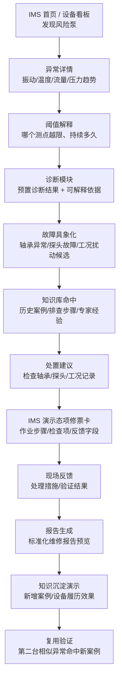
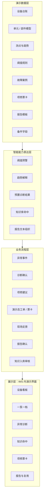

# 输油泵智能运维助手 demo 蓝图与资料补充清单

> 文档用途：demo 开发前的蓝图材料，用来把业务方的愿景描述转成可演示主线、业务流程、数据样例和资料补充清单。  
> 使用方式：拿本文去和业务方确认“首版到底演什么、需要补什么数据、哪些只做演示态”，确认后再进入 demo 搭建。  
> demo 定位：参赛 / 立项用的 IMS 内演示模块，不是生产系统、不是多系统真实联调、不是正式专业模型训练项目。

---

## 1. 先给结论

首版 demo 建议做成：

```text
IMS 内的“振动高高报识别 -> 故障候选具象化 -> 处置票卡闭环 -> 报告沉淀 -> 相似复用”演示。
```

它要解决业务方最想表达的三类痛点：

| 痛点 | 业务方原话里的本质 | demo 中怎么体现 |
|---|---|---|
| 故障判定困难 | 离散的振动、温度、流量、压力数据，需要有经验的人综合研判 | 展示异常趋势、阈值、测点、诊断依据，把振动高高报转成“机械故障 / 仪表故障 / 工况扰动”等候选原因 |
| 维修决策主观 | 大修是否开展依赖运行状态 + 泵效测试，容易到点就修、浪费成本 | 做一个“大修辅助判断卡”，展示运行状态、泵效、累计运行时长和建议，不做完整大修流程 |
| 人员紧张 | 作业区既要巡检维检修，又要盯 SCADA 屏 | 展示“三级监视体系”：系统推送风险，监视中心 / 专家 / 作业区分工，不做完整巡检系统 |

首版主痛点只打“故障判定困难”，把维修决策主观、人员紧张作为侧向价值证明。

首版主线只做一条：

```text
振动高高报识别 -> 故障候选具象化 -> 处置票卡闭环 -> 报告沉淀 -> 相似复用
```

大修和巡检作为辅助价值入口，不做完整流程。

## 2. 建立 4 个心智模型

### 2.1 业务心智模型：不是做大屏，是把异常变成业务动作

```text
过去：
  数据散在不同地方
  阈值和经验靠人看
  故障判断依赖专家
  处置票卡、报告、知识沉淀靠人工整理

demo 要证明：
  IMS 能把异常数据、诊断依据、项修票卡、现场反馈、报告、知识复用串成闭环。
```

一句话：

```text
不是“看见异常”就结束，而是“异常能推动项修，并把经验留下来”。
```

### 2.2 AI 能力心智模型：5 层能力不能混着讲

| 层 | 业务话术 | demo 口径 |
|---|---|---|
| 基础阈值预警 | 有没有异常 | 用预置趋势和阈值线展示，不承诺真实在线计算 |
| 数据预处理 | 把离散数据整理成趋势、测点、时间段 | 用趋势图、异常时间轴、测点状态展示 |
| 专业诊断能力 / 诊断口径表达 | 异常像什么故障 | 首版用“预置诊断结果 + 可解释趋势”表达，不训练真实模型 |
| 企业知识库 / RAG | 为什么这么判断、怎么处理、有没有历史案例 | 用知识命中卡展示案例、作业卡、专家经验、报告模板 |
| NLP / 大模型问答 | 把依据和过程组织成解释、问答、报告 | 首版可做演示态问答和报告生成，不依赖真实 AI API |

关键边界：

```text
大模型不负责凭空判断故障；
诊断结论来自阈值、趋势、专业规则口径和预置诊断结果；
知识库负责找依据和复用经验；
报告生成负责把过程组织成可读材料。
```

### 2.3 IMS 心智模型：IMS 是主舞台，不是外部系统联动 demo

本次 demo 应部署和呈现在 IMS 语境里：

```text
IMS 负责：
  设备档案
  一泵一档
  维护记录
  工单 / 票卡演示态流转
  设备履历
  报告与知识沉淀入口

HSE / 供应链：
  首版不演真实办理、不做真实联动。
  只在项修票卡中保留“安全要求”“备件要求”等字段，作为后续扩展口。
```

### 2.4 参赛心智模型：要证明价值，不是证明系统已建成

参赛 / 立项 demo 的目标：

```text
让评委和领导看懂：
  这个项目能降低故障研判门槛；
  能把经验沉淀到知识库；
  能减少无效维修和重复人工；
  值得继续立项建设。
```

首版不需要证明：

```text
真实专业模型已经训练完成
真实 HSE / 供应链已经打通
真实 IMS 生产流程已经改造
真实知识库已经自动进化
```

## 3. 现有材料能支撑什么

| 材料 | 已经能用于 demo 的内容 | 还不能直接支撑什么 |
|---|---|---|
| 《输油泵机组运行状态监测报告2026年6月-湖南公司》 | 设备状态概述、诊断结论、维护建议；出现“长岭站 P04 泵松动”“衡阳站 P02 泵轴承间隙大，润滑不良” | 缺完整趋势数据、阈值线、测点明细、诊断过程图 |
| 《2025年6月12日汨罗站P-02输油泵非驱动端振动联锁停泵报告》 | 适合做首版主线：非驱动端轴承振动高高报、联锁停泵、排查机械/工况/仪表原因、最终更换振动探头并试运验证 | 需业务方确认可用字段、脱敏口径，并补原始趋势数据、报警阈值、SCADA 报警记录 |
| 《154站004P0202主输泵启泵失败情况说明》 | 可作为历史故障案例和报告模板；包含概况、报警、处理经过、原因分析、逐项排查、排查结论、经验总结、人员确认 | 这是启泵失败 / 机械密封案例，不一定适合作为首版主故障，需业务方确认 |
| 《IMS系统设备预防性维护保养记录填写方法》 | 支撑 IMS 内维护记录、提交审核、审批完成、设备基础信息查看履历的流程 | 没有项修票卡字段、问题信息字段细节 |
| 《IMS系统压缩机（输油泵）单元模型-输油泵已修改.xlsx》 | 可做一泵一档部件树：动力机、传动系统、泵本体、监控系统、润滑系统等 | 缺每个测点与部件的明确映射 |
| 《湖南公司主输泵设备维护保养信息表_-填报.xlsx》 | 可做设备台账、泵参数、轴承/机械密封型号、累计运行时间、大修/4K、备件库存 | 很多阈值字段为空或格式混杂，需要业务方确认展示口径 |
| 《输油泵智能运维助手申报书》 | 支撑项目价值：多源监测、频谱/阈值、知识库、标准化票卡、报告、IMS 一机一档 | 愿景多，不能直接当首版 demo 范围 |
| 《2.输油泵智能运维管理一张图(1).pdf》 | 可作为总体业务蓝图参考 | 本地无法稳定抽取文字，建议业务方提供可编辑版或截图说明 |

按主线阶段看，现有材料覆盖度如下：

| 主线阶段 | 已有材料能支撑 | 还缺什么 |
|---|---|---|
| 振动高高报识别 | 汨罗 P-02 报告、监测月报 | 原始趋势数据、报警阈值、SCADA 报警记录 |
| 故障候选具象化 | 汨罗 P-02 报告里的排查结论、运行状态监测报告里的诊断结论 | 业务确认“机械故障 / 仪表故障 / 工况扰动”的区分口径 |
| 处置票卡闭环 | IMS 维护保养记录流程、单元模型、设备维护保养表 | 振动探头检查 / 更换或轴承检查对应票卡 |
| 报告沉淀 | 154 站报告、汨罗 P-02 报告 | 业务确认正式报告模板和哪些字段必须人工确认 |
| 相似复用 | 申报书中的知识库、案例库、一机一档口径 | 第二台相似异常样例，可由技术方代拟、业务确认 |

## 4. 首版推荐主线

### 4.1 推荐主线：汨罗站 P-02 振动高高报闭环

为什么推荐：

```text
这个案例有完整故事：振动高高报 -> 联锁停泵 -> 现场排查 -> 判断不是简单机械故障 -> 更换振动探头 -> 试运验证。
它能体现“系统辅助判断，而不是 AI 直接替专家下最终结论”。
它也能自然展示：阈值报警、趋势突变、SCADA 报警、测点定位、知识库排查、现场验证、报告沉淀。
```

建议首版把它包装成：

```text
非驱动端轴承振动高高报
  -> 系统先提示“轴承/探头/工况扰动”几类可能原因
  -> 知识库给出逐项排查路径
  -> 专家确认最终为振动探头故障
  -> IMS 内生成演示态项修 / 处置票卡
  -> 现场更换探头并试运验证
  -> 生成报告并沉淀为知识案例
  -> 第二台相似振动突变命中该案例
```

备选主线：

| 主故障候选 | 现有材料支撑 | 适合度 | 需要业务方补充 |
|---|---|---|---|
| 汨罗 P-02 振动高高报 / 振动探头故障 | 汨罗 P-02 振动联锁停泵报告 | **首推** | 原始趋势、报警阈值、SCADA 记录、探头更换票卡 |
| 轴承磨损 / 轴承间隙大 / 润滑不良 | 运行状态监测报告、维护保养表、备件表 | 备选 | 异常趋势、阈值、测点、轴承类项修票卡 |
| 机械密封异常 | 154 站启泵失败报告、维护保养表、备件表 | 备选 | 是否适合参赛主线、密封温度/压力/泄漏类趋势 |
| 松动 / 地脚螺栓问题 | 运行状态监测报告有长岭站 P04 泵松动 | 可选 | 振动趋势、排查步骤、作业卡 |
| 不对中 | 申报书提到，但当前样例不足 | 可选但需补材料 | 对中判断口径、趋势、案例、票卡 |
| 泵效下降 | 可支撑大修决策辅助，不建议做项修主线 | 分支卡片 | 泵效测试结果、计算口径、预测性维修标准 |

业务方需要拍板：

```text
首版主故障到底选哪一个。
如果业务方认可汨罗 P-02 报告可用于参赛 demo，建议优先选它。
如果业务方更想展示“典型机械故障”，再选轴承 / 润滑异常。
```

## 5. 首版 demo 业务流程



这条主线的演示节奏：

| 步骤 | 业务方看到什么 | 价值 |
|---|---|---|
| 1. 风险出现 | IMS 看板上某台泵变成风险状态 | 演示系统如何发现和呈现风险 |
| 2. 数据证据 | 振动、温度、流量、压力趋势和阈值 | 异常不是凭空判断 |
| 3. 故障具象化 | 系统把信号转成“轴承异常 / 探头故障 / 工况扰动”等候选原因 | 降低专家经验依赖，并避免单一误判 |
| 4. 知识命中 | 命中历史案例、作业卡、专家经验 | 建议不是黑盒 |
| 5. 处置票卡 | IMS 内展示标准化检查 / 项修 / 处置票卡 | 诊断能进入业务动作 |
| 6. 现场反馈 | 录入处理措施、验证结果 | 处置过程可追踪 |
| 7. 报告生成 | 生成维修报告预览 | 减少人工整理 |
| 8. 知识复用 | 第二台相似异常命中新案例 | 证明经验能复用 |

## 6. 辅助场景怎么放

首版不要把大修、巡检、计划维保都展开成流程。建议只做“可见价值入口”。

| 场景 | 首版表现 | 不展开的内容 | 需要补充 |
|---|---|---|---|
| 计划性维检修 | 在设备详情里展示“4K 保养 / 下次维保计划 / 上次维保记录” | 不做完整计划编制、审批 | 维保周期、作业项目、记录样例 |
| 大修辅助判断 | 做“大修建议卡”：运行状态 + 泵效测试 + 累计运行时间 + 建议 | 不做完整大修方案、物料、审批、现场大修流程 | 泵效测试数据、预测性维修标准、大修判断口径 |
| 巡检 / 三级监视 | 做角色分工示意：系统预警 -> 监视中心 -> 专家 -> 作业区 | 不做巡检 App，不做 SCADA 盯屏替代系统 | 三级角色职责、报警推送口径 |

这样可以覆盖业务方三类痛点，但首版仍保持一条主线。

## 7. demo 架构



边界说明：

```text
首版可把 HSE / 供应链作为字段或扩展入口保留；
不演真实 JSA 分析、票证办理、采购、库存流转、厂商派工；
不接真实专业模型，不训练模型，不承诺实时诊断准确率。
```

## 8. 数据怎么补

### 8.1 一套可开发的演示数据包

请业务方尽量按下面结构补。能给真实脱敏数据最好，不能给就让业务方确认技术方代拟样例。

| 数据包 | 最低需要 | 已有材料可支撑 | 还缺什么 |
|---|---|---|---|
| 主角设备 | 站场、设备编号、型号、厂家、结构、关键部件 | 维护保养信息表 | 业务方确认选哪台泵做主角 |
| 单元 / 部件 | 动力机、传动系统、泵本体、监控系统、润滑系统 | IMS 单元模型表 | 异常测点映射到哪个部件 |
| 测点数据 | 振动、温度、流量、压力，至少 24-72 小时 | 申报书和业务描述有类型 | 实际趋势样例、单位、采样频率 |
| 阈值规则 | 正常、预警、报警、停机值 | 维护保养表有阈值字段但多为空 | 业务确认阈值或演示阈值 |
| 诊断口径 | 数据现象对应什么故障特征 | 运行状态报告给了诊断结论 | “为什么判断为该故障”的规则说明 |
| 历史案例 | 现象、原因、排查、处理、结果 | 154 站报告、运行状态报告 | 主故障对应案例 2-3 条 |
| 处置票卡 | 作业步骤、检查项、安全要求、备件要求、验收标准 | IMS 维护记录流程有操作路径 | 主故障对应检查 / 项修 / 探头更换处置票卡 |
| 现场反馈 | 处理措施、验证结果、附件、确认人 | 154 站报告有处理过程 | 首版页面字段和样例 |
| 报告模板 | 概况、报警、处理、原因、结论、经验、人员确认 | 154 站报告结构可参考 | 业务确认正式报告模板 |
| 复用样例 | 第二台相似异常 | 可由技术方代拟 | 业务确认不穿帮 |

### 8.2 异常趋势数据怎么补

不要只给一张截图。最好按下面格式给一段表格：

| 时间 | 测点 | 数值 | 单位 | 阈值 | 状态 | 说明 |
|---|---|---:|---|---:|---|---|
| T-72h | 非驱动端轴承振动 | 业务方补 | mm/s | 业务方补 | 正常 | 正常段 |
| T-24h | 非驱动端轴承振动 | 业务方补 | mm/s | 业务方补 | 预警 | 异常发展 |
| T0 | 非驱动端轴承振动 | 业务方补 | mm/s | 业务方补 | 高高报 / 联锁 | 触发事件 |
| T+4h | 非驱动端轴承振动 | 业务方补 | mm/s | 业务方补 | 恢复 | 处置后验证 |

同一条主线建议至少补：

```text
1 个主测点：例如轴承振动
1 个辅助测点：例如轴承温度
1 个工况测点：例如流量或压力
1 个恢复验证点：处置后数值回落
```

### 8.3 诊断口径怎么补

业务方不用给复杂算法，但要给业务解释口径：

| 业务要补的口径 | 示例 |
|---|---|
| 哪些测点异常 | 非驱动端轴承振动升高、轴承温度同步升高 |
| 异常持续多久算风险 | 连续 N 小时 / N 个采样点超过预警值 |
| 为什么怀疑某类故障 | 振动突变 + 工况未明显变化 + 历史案例共同指向轴承、探头或工况扰动候选 |
| 为什么建议处置 | 知识库命中过往类似案例，建议按“机械原因、仪表原因、工况原因”逐项排查 |
| 什么情况升级专家 | 无法确认根因、趋势持续恶化、停机值触发 |

## 9. 知识库怎么做成参赛亮点

知识库不要只是“资料库”。demo 里要演 4 个动作：

```text
查依据：
  异常发生后，命中相似案例、标准作业卡、专家经验。

给建议：
  根据依据生成排查步骤和项修建议。

成报告：
  根据诊断、处理、验证结果形成报告草稿。

再复用：
  报告确认后形成新增案例，第二台相似异常命中它。
```

知识库首版建议放 5 类内容：

| 知识类型 | demo 用法 | 业务方需提供 |
|---|---|---|
| 历史故障案例 | 支撑相似案例命中 | 主故障相关 2-3 条 |
| 标准作业卡 / 处置票卡 | 支撑处置建议 | 主故障对应 1 份 |
| 专家经验 | 支撑排查步骤 | 3-5 条短规则 |
| 设备档案 / 履历 | 支撑设备上下文 | 选定主角泵的一泵一档 |
| 报告模板 | 支撑报告生成 | 1 份正式模板或脱敏报告 |

入库审核口径：

```text
demo 可以演示“系统生成案例摘要 -> 专家确认 -> 演示态入库”；
不承诺真实自动抽取、实时入库、实时索引更新。
```

## 10. 页面与演示效果

首版建议做 8 个核心页面 / 状态，不需要更多。

| 页面 / 状态 | 业务方看到什么 | 需要的数据 |
|---|---|---|
| 1. IMS 风险看板 | 哪台泵异常、风险等级、当前状态 | 主角泵、背景泵、状态 |
| 2. 一泵一档 | 设备参数、部件树、历史维保、备件摘要 | 维护保养表、单元模型、备件表 |
| 3. 异常趋势 | 振动 / 温度 / 流量 / 压力曲线、阈值线 | 趋势数据、阈值 |
| 4. 诊断解释 | 疑似故障、判断依据、专家确认 | 故障类型、诊断口径 |
| 5. 知识命中 | 相似案例、作业卡、专家经验 | 知识库样例 |
| 6. 处置票卡 | 检查项、作业步骤、反馈字段 | 检查 / 项修 / 探头更换处置票卡 |
| 7. 现场反馈与报告 | 处理过程、验证结果、报告预览 | 反馈样例、报告模板 |
| 8. 知识复用 | 第二台相似异常命中新增案例 | 第二台样例 |

## 11. 业务方需要补充和确认的材料清单

### 11.1 业务方必须提供原始事实

这些材料决定 demo 是否“像真实业务”，建议尽量由业务方提供。

| 编号 | 材料 | 为什么必须要 |
|---|---|---|
| M1 | 主角泵确认 | 决定首页、一泵一档、趋势、报告里的设备 |
| M2 | 主异常测点 / tag | 决定异常图怎么画、点位怎么高亮 |
| M3 | 24-72 小时趋势数据或报警前后数据 | 用于演示风险识别路径和异常发展过程 |
| M4 | 阈值 / 预警等级 / 联锁口径 | 用于解释为什么报警、为什么触发处置 |
| M5 | SCADA / 监测报警记录 | 用于支撑事件发生时间、报警描述、恢复时间 |
| M6 | 现场处置和验证事实 | 支撑闭环和报告 |
| M7 | 报告模板或脱敏报告 | 支撑标准化报告生成 |

### 11.2 业务方必须确认口径

这些不一定都要给完整文件，但必须由业务方拍板确认。

| 编号 | 确认项 | 推荐口径 |
|---|---|---|
| C1 | 首版主故障 / 主事件 | 优先汨罗 P-02 振动高高报；如业务不同意，可改轴承 / 润滑异常 |
| C2 | 故障候选口径 | 区分机械故障、仪表故障、工况扰动 |
| C3 | 处置票卡类型 | 探头检查 / 更换、轴承检查或其他主事件对应票卡 |
| C4 | 知识库内容 | 历史案例、作业卡、专家经验、报告模板 |
| C5 | 报告哪些字段可自动生成 | 建议“草稿生成 + 专家确认” |
| C6 | HSE / 供应链展示深度 | 首版只做字段和扩展入口，不做真实办理 |
| C7 | 大修辅助卡是否保留 | 保留为侧向价值入口，不展开流程 |
| C8 | 三级监视入口是否保留 | 保留为角色分工示意，不做完整巡检系统 |


### 11.3 技术方可代拟，业务方过目

这些材料可以先由技术方根据现有资料构造，但最终必须业务方确认“不穿帮”。

| 材料 | 用途 |
|---|---|
| 第二台相似异常样例 | 用于知识复用验收 |
| 背景设备状态 | 用于 IMS 风险看板，不影响主线 |
| 知识命中卡片文案 | 用于展示相似案例和作业依据 |
| 报告摘要 / 新增案例摘要 | 用于知识沉淀演示 |
| 演示阈值 | 业务方无法提供正式阈值时临时代拟，不能宣称生产标准 |

### 11.4 当前材料已能先用

| 可先用内容 | 来源 |
|---|---|
| 汨罗站 P-02：非驱动端轴承振动高高报、联锁停泵、最终更换振动探头并试运验证 | 汨罗站 P-02 振动联锁停泵报告 |
| 长岭站 P04 泵：松动，建议检查基础和地脚螺栓 | 2026 年 6 月运行状态监测报告 |
| 衡阳站 P02 泵：轴承间隙大、润滑不良，建议检查轴承、注意润滑 | 2026 年 6 月运行状态监测报告 |
| 154 站 004P0202：机械密封轴套窜出导致无法启泵 | 154 站启泵失败情况说明 |
| IMS 维护记录路径：作业项目、策略、记录、提交、审核、设备基础信息查看 | IMS 设备预防性维护保养记录填写方法 |
| 一泵一档字段、轴承/密封/大修/4K/备件库存 | 主输泵设备维护保养信息表 |
| 部件树：动力机、传动系统、泵本体、监控系统、润滑系统 | IMS 输油泵单元模型 |

## 12. 开发前冻结项

在开始实际 demo 开发前，至少冻结这 8 件事：

| 冻结项 | 推荐 |
|---|---|
| 主线 | 振动高高报识别 -> 故障候选具象化 -> 处置票卡闭环 -> 报告沉淀 -> 相似复用 |
| 主故障 | 优先汨罗 P-02 振动高高报，业务方可改为轴承 / 润滑异常 |
| 主角设备 | 从维护保养表中选一台字段较完整的泵 |
| 异常测点 | 至少 1 个振动、1 个温度、1 个工况测点 |
| 阈值 | 业务方给正式阈值；没有则确认演示阈值 |
| 票卡 | 主故障对应一张检查 / 项修 / 处置票卡 |
| 报告 | 一份脱敏报告模板 |
| 复用 | 第二台相似异常命中新案例 |

## 13. 不做项

首版明确不做：

```text
不训练真实专业模型
不接真实 AI API 作为硬依赖
不接真实 HSE 票证办理
不接真实供应链采购流程
不做真实 IMS 生产流程改造
不做完整大修流程
不做完整巡检系统
不做多故障并行主线
```

保留扩展表达：

```text
票卡里可以显示“安全要求”“备件要求”；
设备详情里可以显示“大修辅助判断卡”“计划维保入口”“三级监视入口”；
但首版演示重心仍是“振动高高报识别 -> 故障候选具象化 -> 处置票卡闭环 -> 报告沉淀 -> 相似复用”。
```

## 14. 拿给业务方的沟通口径

可以直接这样说：

```text
我们先不把 demo 做成完整平台，也不做真实多系统联动。
首版建议围绕一台泵、一次典型振动高高报事件、一条处置票卡闭环来演。

业务方需要先帮我们确认：
  选哪个故障；
  用哪台泵；
  哪些测点异常；
  阈值是多少；
  诊断依据是什么；
  对应哪张检查 / 项修 / 处置票卡；
  报告模板长什么样；
  第二台相似异常怎么验证复用。

这些确认后，我们就可以把 demo 做成可演示、可讲清楚、可立项的版本。
```
