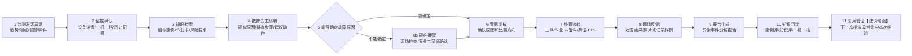
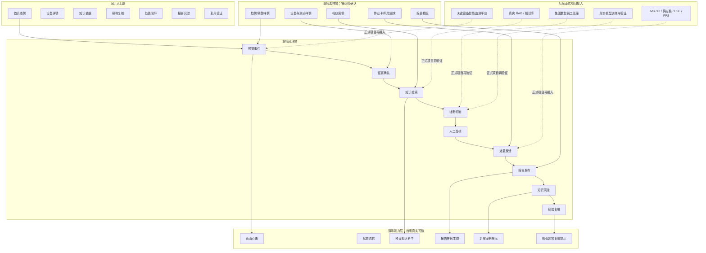

# 输油泵智能运维助手 demo 综合分析与落地骨架

> 文档性质：重新分析后的 demo 主方案骨架。  
> 用途：用于内部统一判断，也可拆成业务会讨论稿。  
> 依据材料：`notes/输油泵智能运维助手申报书.md`、`pic/` 下业务流程图与仪表点位图。  
> 核心口径：首版 demo 用于立项演示，先证明业务闭环、知识依据、人工确认和经验复用，不承诺真实生产系统集成、不承诺真实 AI 接入。

---

## 1. 重新分析后的核心判断

参赛作品真正想表达的不是“做一个监测大屏”，也不是“做一个 AI 聊天窗口”，而是：

```text
围绕输油泵全生命周期运维，
把监测预警、故障诊断、知识依据、人工复核、作业处置、报告沉淀、经验复用串成一条闭环，
从而证明运维模式可以从“被动维修”走向“预测性维护”。
```

因此，首版 demo 的判断标准不是功能数量，而是观众能否看懂：

```text
问题怎么发现
依据怎么找
AI / 数智员工怎么辅助
人在哪些关键点确认
处置怎么推进
报告和知识怎么沉淀
沉淀后的经验下次怎么复用
```

## 2. 材料给出的业务线索

### 2.1 参赛申报材料的关键线索

| 线索 | 材料含义 | 对 demo 的影响 |
|---|---|---|
| 1558 台主泵、128 台接入频谱、8.2% 接入率 | 监测覆盖不足，智能运维有现实痛点 | 首页态势可展示这些数字，但不做全量设备管理 |
| 远程监测诊断、巡检、维护检修、项修、大修五大环节 | 业务愿景覆盖全场景 | 首版不能全做，应选一条主线 |
| 三级体系：储运技术公司、区域监视中心、作业区 | 业务不是单角色操作 | demo 要体现专家、监视中心、现场作业人员的接力 |
| WeAgent / 数智员工参与排查全流程 | AI 被定位为流程助手 | demo 要体现辅助研判、辅助成文、辅助流转，不写成无人自动处置 |
| 历史故障案例库、标准作业卡、知识库、一机一档 | 具备 RAG / 知识检索表达基础 | RAG 可以作为“知识依据可视化”，但原文没有直接写 RAG |
| 模拟数据集即可完整演示全业务流程 | demo 范围谈判锚点 | 首版可用模拟/脱敏素材，不以真实接口为前提 |

### 2.2 业务流程图的关键线索

| 流程图 | 判断 | 在首版 demo 中的角色 |
|---|---|---|
| 泵机组集中监测诊断管理 | 最完整覆盖“预警 -> 诊断 -> 处置 -> 报告 -> 知识更新” | **首版主线** |
| 泵机组日常巡检管理 | 起点是人工巡检发现问题，智能体辅助记录和排查 | 扩展场景 |
| 泵机组计划性维护保养（4K） | 起点是运行时间和计划维护，适合讲计划型运维 | 扩展场景 |
| 泵机组项修 | 更偏方案、审批、物料、现场项修 | 后续扩展 |
| 泵机组大修 | 流程长、审批和物料环节多 | 不适合首版主线 |
| 输油泵机组仪表点位 | 不是流程，是设备证据底图 | 用在设备详情页，高亮异常测点 |

### 2.3 从“集中监测诊断管理”流程图抽出的 demo 节点

这张流程图不是泛泛的系统架构图，而是最接近首版 demo 的业务流程图。它给出的主线节点可以直接转成 demo 骨架：

| 流程图节点 | 对 demo 的含义 | 首版展示方式 |
|---|---|---|
| 关键设备智能监测平台监测预警、诊断结论 | 异常从监测侧触发，不是人工随便造事件 | 首页风险卡片 + 设备详情 |
| 泵机组重要报警或计划停机，移动端录入 | 事件进入 IMS 事件中心，形成业务对象 | 预警事件卡片 |
| 填写事件描述，支持语音识别、图像记录 | 现场/值班人员补充事件上下文 | 演示为预填事件描述，不做真实语音/图像识别 |
| 根据故障溯源知识库给出可能原因、推荐方向、关联历史案例 | 这是 RAG / 企业知识库最适合展示的位置 | 知识命中页：相似案例、推荐方向、依据来源 |
| 根据建议逐条排查 | 数智员工不是直接定论，而是引导排查 | 排查步骤清单 |
| 能否确定故障原因 | 流程图里有明确判断分支 | demo 必须展示“确认 / 转人工疑难”的分支 |
| 不能确定时，现场排查定位或列入疑难故障，由专业运维工程师确认 | AI 不能闭眼自动判断，疑难问题由专家接管 | 专家复核页保留“调整结论”能力 |
| 确定后给出维检修建议，现场维检修准备 | 诊断结果进入处置准备 | 作业卡、工单、备件、票证关系 |
| 供应链、HSE、PPS 与统建系统联动 | 流程需要跨系统，但首版不必真实集成 | 页面内关系示意 |
| 维检修完成，IMS 推送审批并更新机组履历 | 处置结果要进入履历 | 一机一档更新效果 |
| 故障处理结果验证、举一反三经验分享 | 知识不是只归档，还要用于后续防范 | 演示为知识沉淀后的复用提示 |
| 报告处理智能体抽取报告内容并更新知识库 | 报告是知识沉淀入口 | 报告发布后生成新增案例摘要 |

## 3. 首版 demo 应该做成什么

推荐形态：

```text
可交互业务闭环演示版
```

不是：

```text
静态 PPT 页面
真实生产系统
真实 AI 平台搭建
全流程五场景大平台
```

首版 demo 的合理边界：

| 内容 | 首版做法 |
|---|---|
| 页面交互 | 做真实可点击、状态可变化 |
| 业务数据 | 用模拟/脱敏/业务确认素材 |
| AI 效果 | 用预设示例展示数智员工效果 |
| RAG / 知识库 | 做知识命中、引用依据、沉淀效果，并【建议增强】复用验证 |
| 生产系统 | 不真实接入，仅展示业务关系 |
| 报告生成 | 点击生成报告样例，不要求真实模型生成 |
| 知识回流 | 展示新增效果，并【建议增强】一个“下一次复用验证” |

## 4. 推荐主线：集中监测诊断闭环

为什么选这条：

```text
它有异常触发，适合讲“预测性维护”。
它有监测数据和测点，适合讲“证据”。
它有历史案例和作业卡，适合讲“RAG / 企业知识库”。
它有专家复核和现场作业，适合讲“AI + 人工协同”。
它有报告和知识库更新，适合讲“可进化”。
它可以【建议增强】一次“相似异常复用”，证明沉淀不是归档。
```

其他流程不进入首版完整主线：

```text
日常巡检：作为扩展入口。
计划性维护：作为后续扩展能力。
项修 / 大修：流程更长，首版不展开。
```

## 5. 完整逻辑链闭环

材料直接支持的闭环是“报告更新知识库、IMS 履历更新、举一反三经验分享”。为了让立项 demo 更清楚地证明“可进化”，建议在收尾补一个轻量“复用验证”。



最后一步是演示增强，不是材料原文中的新增承诺。演示上不用再做第二条完整流程，只需 30-60 秒：

```text
模拟出现一条相似异常
  -> 知识库命中“刚刚沉淀的案例”
  -> 页面提示可复用排查步骤、作业风险提醒、处置建议
  -> 证明本次处置经验已变成下一次研判依据
```

## 6. AI 自动化与人工接入点

这个 demo 不能表达成“AI 全自动运维”。更稳妥的表达是：

```text
AI 负责辅助：
  找线索、找依据、给建议、写草稿、促流转、做复用提示。

人工负责把关：
  诊断结论、处置决策、现场执行、报告发布、知识入库确认。
```

| 节点 | 数智员工 / AI 辅助什么 | 人工接入点 | demo 展示方式 |
|---|---|---|---|
| 异常发现 | 汇总趋势、测点、预警信息 | 监视中心查看预警 | 首页风险卡片 + 设备详情 |
| 知识检索 | 检索相似案例、作业卡、风险要求、设备履历 | 业务人员查看依据 | 知识命中列表 |
| 辅助研判 | 给疑似原因、排查步骤、建议动作 | 若不能确定原因，转现场排查或专业工程师接管 | “能否确定故障原因”分支 |
| 专家复核 | 对已形成的判断做确认或调整 | 专家确认原因和处置方向 | 专家复核按钮 |
| 处置流转 | 生成工单样例、作业卡、备件和票证关系 | 管理人员确认处置 | 页面内状态流转 |
| 现场反馈 | 引导记录处理结果 | 作业区人员提交反馈 | 移动端样式页 |
| 报告生成 | 汇总过程并生成报告样例 | 专家评判后发布 | 报告预览 + 发布确认 |
| 知识沉淀 | 抽取案例摘要、更新知识条目样例 | 技术人员确认入库 | 知识入库确认页 |
| 复用验证 | 下一次相似异常命中历史经验 | 人员确认是否采用建议 | 复用提示卡片 |

## 7. RAG / 企业知识库在 demo 中怎么体现

原材料没有直接写 “RAG”，但写了历史故障案例库、运维知识库、知识图谱、标准作业卡、一机一档、数智员工关联案例并给出排查方向。因此，demo 中可以把 RAG 业务化表达为：

```text
数智员工不是凭空回答，
而是先从企业知识库中找依据，
再基于依据给出排查建议、报告内容和复用提示。
```

### 7.1 知识边界

流程图底部把知识库拆得比较清楚。首版 demo 应按“可检索依据”和“流程联动素材”分开，避免把所有东西都叫知识库。

可作为 RAG / 知识检索依据的内容：

| 知识类型 | demo 中展示什么 |
|---|---|
| 故障诊断知识库 | 故障溯源、相似案例、历史故障信息、历史维修信息、历史技术通告 |
| 标准化维检修知识库 | 标准作业卡、维检修指导书、作业步骤、物料需求模板 |
| 作业风险知识库 | HSE 风险点、票证要求、风险管控措施 |

不宜直接叫 RAG 知识库，但可作为页面联动素材的内容：

| 素材类型 | demo 中展示什么 |
|---|---|
| 设备一机一档 | 设备档案、历史履历、测点记录 |
| 报告模板 | 异常事件分析报告结构 |
| 供应链 / HSE / PPS 状态 | 备件、票证、异常事件的业务关系示意 |

### 7.2 展示方式

```text
预警后：
  显示“正在检索企业知识库”

检索后：
  展示命中 3 条相似案例、2 条作业依据、1 条风险要求、1 条设备履历

研判时：
  每条建议旁边标注引用依据

报告中：
  标注参考案例、作业依据、专家确认结论

沉淀后：
  展示新增案例摘要、一机一档更新字段

复用时：
  下一次相似异常命中本次新增案例
```

### 7.3 首版不做什么

```text
不做真实 RAG 引擎。
不做真实向量库检索效果验证。
不做开放式自由问答。
不写入真实生产知识库。
```

首版只做“知识依据可见 + 引用关系可见 + 复用效果可见”。

## 8. 分层架构

这张图是 demo 分层架构，不是生产系统实施架构。



## 9. 页面与演示效果

| 页面 | 观众看到什么 | 证明什么 |
|---|---|---|
| 首页态势 | 1558 台、128 台、8.2% 等现状数字，主角设备风险提示 | 业务痛点真实存在 |
| 设备详情 | 仪表点位图、异常测点高亮、趋势曲线、历史记录 | 异常有证据，不是凭空告警 |
| 知识依据 | 命中故障案例、作业卡、风险要求，并旁边展示设备履历 | 知识依据在流程中可见，设备履历作为辅助证据 |
| 研判复核 | 数智员工给出疑似原因和排查步骤，专家确认 | AI 辅助、人工把关 |
| 处置闭环 | 工单、作业卡、备件、HSE、PPS 关系示意 | 预警能推动处置，不是单点功能 |
| 作业反馈 | 移动端样式页提交处理结果 | 前端作业区纳入闭环 |
| 报告沉淀 | 生成异常事件分析报告样例，专家发布 | 过程可追溯、可成文 |
| 复用验证【建议增强】 | 下一次相似异常命中新案例并推荐步骤 | 知识不是归档，而是可复用 |

## 10. 关键工程决策

### 10.1 AI 接入

推荐首版：

```text
不接真实 AI API。
不本地部署模型。
用预设示例和页面交互展示数智员工效果。
```

原因：

```text
业务已明确首版重点是立项演示。
现场稳定性比真实生成更重要。
材料已说明模拟数据可演示全业务流程。
真实模型、集团底座、内网权限适合作为二阶段验证。
```

### 10.2 时序数据

推荐首版：

```text
需要趋势数据样例。
不需要建设真实时序数据平台。
```

展示方式：

```text
72 小时趋势回放
异常测点高亮
温度 / 振动 / 压力 / 电流等曲线样例
```

### 10.3 OCR / 图像记录

推荐首版：

```text
只做事件描述和现场记录样例。
不做真实语音识别、OCR 或图像识别。
```

原因：

```text
流程图里出现“语音识别、图像记录、OCR识别纸质记录”，但它们服务于现场记录和报告生成。
首版主线的核心是监测诊断闭环，不应把识别能力变成主卖点。
```

### 10.4 知识库 / RAG

推荐首版：

```text
做知识命中过程可视化。
做引用依据可视化。
做知识沉淀，并【建议增强】复用验证。
不做真实 RAG 引擎。
```

### 10.5 生产系统接口

推荐首版：

```text
不接 IMS / PI / 供应链 / HSE / PPS 真实接口。
页面内展示业务关系和状态流转。
正式项目再逐个替换适配器。
```

## 11. 需要准备的演示素材

| 素材 | 用途 | 获取方式 |
|---|---|---|
| 主角设备样例 | 首页和设备详情 | 业务提供或确认 |
| 仪表点位图 | 异常测点高亮 | 使用业务补充图 |
| 72 小时趋势样例 | 异常预警证据 | 技术方构造，业务确认合理性 |
| 相似故障案例 2-3 条 | 知识命中和复用 | 业务脱敏提供或技术方构造 |
| 作业卡 / 指导书样例 | 推荐处置步骤 | 业务提供样例 |
| HSE 风险要求样例 | 风险提示和票证关系 | 业务提供样例 |
| 工单 / 备件 / 票证样例 | 处置闭环展示 | 技术方构造，业务确认 |
| 报告模板 | 报告生成页面 | 业务提供或确认栏目 |
| 新增案例样例 | 知识沉淀与复用 | 技术方根据报告抽取 |

## 12. 业务方必须拍板的问题

| 编号 | 问题 | 推荐答案 |
|---|---|---|
| Q1 | 首版主线是否锁定“泵机组集中监测诊断管理” | 是 |
| Q2 | 故障场景选“异常振动 / 轴承类 / 不对中类”哪一种 | 推荐先选业务最容易确认的一种 |
| Q3 | 是否接受首版不接真实 AI | 接受 |
| Q4 | 是否接受首版不接真实生产系统 | 接受 |
| Q5 | RAG 是否按“知识命中 + 引用依据 + 沉淀效果”展示 | 是 |
| Q6 | 专家复核是否保留 | 保留，这是可信度关键 |
| Q7 | 知识入库是否需要人工确认节点 | 建议保留，避免误解为错误知识自动入库 |
| Q8 | 是否增加“复用验证”作为演示收尾 | 建议加入，但标注为演示增强 |
| Q9 | 业务素材由谁提供 | 业务提供关键样例，技术方补齐演示素材，业务确认合理性 |

## 13. 首版 demo 推荐组合

```text
主线：
  泵机组集中监测诊断管理

触发：
  某输油泵异常趋势 / 异常振动预警

核心闭环：
  预警
    -> 设备证据
    -> 知识检索
    -> 辅助研判
    -> 能否确定故障原因
    -> 专家复核
    -> 处置流转
    -> 作业反馈
    -> 报告生成
    -> 知识沉淀
    -> 相似异常复用验证【建议增强】

AI 口径：
  数智员工效果展示，不接真实 AI

RAG 口径：
  知识命中过程可视化，不做真实 RAG 引擎

系统口径：
  不接生产系统，只展示业务关系

演示时长：
  8-12 分钟

验收口径：
  主线可完整走通，知识依据可见，人工确认点可见，复用验证可见
```

## 14. 不建议首版做的内容

| 内容 | 不建议原因 | 何时再做 |
|---|---|---|
| 五大场景全量闭环 | 首版会变大而散，难以讲清主线 | 主线通过后做扩展 |
| 真实 AI API / 本地模型部署 | 现场稳定性、权限和输出可控性风险高 | 二阶段技术验证 |
| 真实 RAG 引擎 | 首版业务价值可用可视化表达 | 业务确认知识结构后 |
| 真实生产系统接口 | 权限、联调、数据安全和周期不可控 | 正式项目 |
| 真实 OCR / 图像识别 | 首版可用记录样例表达，不应喧宾夺主 | 若现场记录成为独立展示重点 |
| 原生移动 App | 移动端样式页足够表达作业反馈 | 正式项目或试点 |
| 深度模型训练 | 历史故障库本身缺失，训练数据不足 | 数据积累后 |

## 15. 会议收口话术

```text
这次 demo 不建议做成五个场景的大平台，也不建议先投入真实 AI 或真实接口。

我们建议先选“泵机组集中监测诊断管理”作为主线，
因为它最能体现预警、诊断、知识依据、人工复核、处置、报告、知识沉淀和经验复用。

RAG / 企业知识库在 demo 里不讲成技术概念，
而是让领导看到：
  系统命中了哪些案例，
  引用了哪些作业依据，
  专家在哪里确认，
  处理结果如何沉淀，
  下一次相似异常如何复用这次经验。

首版目标不是证明生产系统已经建成，
而是证明这条业务闭环值得立项、可演示、可扩展。
```
