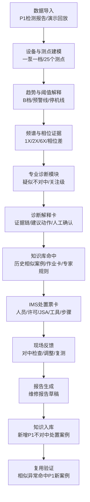

# 输油泵智能运维助手 demo 研发基准文档

> 文档性质：首版 demo 研发基准文档。  
> 文档目标：把业务主线、节点输入输出、数据模型、关键指标、mock JSON 和演示边界固定下来，作为后续 demo 开发、业务确认和迭代的共同依据。  
> 当前基准主线：长岭站 P-1 输油泵机组“不对中诊断 -> 对中处置 -> 报告入库 -> 知识复用”闭环。  
> 依据材料：`P1/湖南公司长岭站P-1输油泵机组状态检测与评估报告.docx`、`P1/04-ZLMI400 07型鲁尔输油泵对中作业卡.doc`、`docs/输油泵智能运维助手-demo-P1不对中诊断闭环报告.md`。

---

## 1. 本文怎么用

本文不是业务愿景材料，也不是生产系统设计说明，而是 demo 开发前的稳定基准。

它回答 5 个问题：

```text
1. 首版 demo 到底演哪条主线；
2. 每个业务节点需要什么输入、产生什么输出；
3. 哪些指标来自业务材料，哪些是演示构造，哪些待业务补充；
4. 趋势图、频谱图、相位图、诊断卡、知识卡、作业卡、报告分别需要什么数据；
5. 后续研发和业务变更应该围绕哪些数据契约调整。
```

后续 demo 开发优先按本文执行。业务新增想法时，先判断它落在哪个节点、增加哪个字段、影响哪个页面，再决定是否进入首版。

## 2. 首版结论

首版 demo 主线收敛为：

```text
长岭站 P-1 检测报告导入
  -> 结构化设备 / 测点 / 振动 / 频谱 / 相位数据
  -> 专业诊断模块输出“疑似不对中”
  -> 诊断解释展示 2X 频谱、相位差、基础振动等证据
  -> 知识库命中历史相似案例 / 对中作业标准模板卡 / 专家规则
  -> 人工确认后在 IMS 中生成对中处置票卡
  -> 现场执行对中检查 / 调整 / 复测
  -> 生成维修报告草稿
  -> 专家确认后将本次 P1 处置入库为新案例
  -> 后续相似异常命中 P1 新案例并复用
```

首版不再以“汨罗 P-02 振动高高报 / 探头故障”为主线。旧主线的闭环结构保留，但首版主事件替换为 **长岭 P-1 不对中诊断闭环**。

首版 demo 的能力边界：

```text
做：演示态诊断闭环、mock 数据、可解释证据链、知识命中、处置票卡、报告草稿、知识复用。
不做：真实模型训练、真实在线监测接入、真实 HSE / 供应链联动、真实生产 IMS 改造、自动替代专家签发结论。
```

本文中出现的 `IMS 处置票卡`、`知识入库`、`签字`、`关闭票卡` 都指 **demo 演示态页面对象**，不代表已经改造或写入真实生产 IMS。

## 3. 基础事实和演示假设

### 3.1 材料事实

| 事实 | 值 | 来源 |
|---|---|---|
| 站场 | 长岭站 | P1 检测报告 |
| 主设备 | P-1 输油泵机组 | P1 检测报告 |
| 检测日期 | 2025-04-08 | P1 检测报告 |
| 电机型号 | YB2-560M2-2W | P1 检测报告 |
| 泵型号 | KSY900-225 | P1 检测报告 |
| 转速 / 转频 | 约 3000r/min / 50.00Hz | P1 检测报告及频谱图 |
| 测点数量 | 25 个 | P1 检测报告 |
| 最大振动值 | 2.62mm/s | P1 检测报告，表格显示为泵驱动端垂直 |
| 状态分级 | B，良 | P1 检测报告 |
| 频谱证据 | 49.7Hz、100.3Hz、约 298-299Hz | P1 检测报告及图片 |
| 相位证据 | 约 90° / 150°，相关性约 0.95-0.99 | P1 检测报告及图片 |
| 诊断结论 | 机组存在不对中情况，建议择机检查对中 | P1 检测报告 |
| 作业卡 | ZLMI400/07 型鲁尔输油泵对中作业卡 | P1 作业卡 |

### 3.2 演示假设

| 假设 | 默认口径 | 后续可调项 |
|---|---|---|
| 作业卡适配 | 现有对中作业卡作为“输油泵对中作业标准模板卡”使用，标注待业务确认适配长岭 P-1 | 若业务提供 P-1 对应作业卡，则替换模板 |
| 阈值 | A/B=2.3，B/C=4.5，C/D=7.1；5.68=7.1*80%，仅作为演示预警线 | 业务确认正式阈值后替换 |
| 事件触发 | 检测报告导入 + 不对中特征命中 + 人工确认，生成关注级诊断事件 | 不说实时报警自动派工 |
| 诊断分数 | `86/100` 仅作为演示证据匹配分，非真实模型置信度 | 业务如有模型分值口径，可替换 |
| 现场反馈 | 处置后振动、温度、对中仪结果、垫片调整量先用演示构造 | 业务提供真实样例后替换 |
| 知识复用 | 构造第二台相似异常，证明可命中新入库案例 | 业务可指定真实设备或确认代拟样例 |

## 4. 总体业务流程



## 5. 节点输入输出规格

| # | 节点 | 归属 | 输入 | 输出 | 关键指标 / 字段 | 人工确认 |
|---|---|---|---|---|---|---|
| 1 | 数据导入与事件建档 | IMS 流程 | P1 检测报告、演示回放数据 | 关注级诊断事件、事件编号、数据来源 | `event_id`、`asset_id`、`source`、`is_realtime_alarm=false` | 确认 P1 可用于 demo |
| 2 | 设备与测点建模 | IMS / 数据层 | 设备参数、25 个测点、测点布置图 | 一泵一档、测点列表、关键测点高亮 | 站场、设备、部件、方向、测点 ID | 测点与部件映射可后续确认 |
| 3 | 趋势与阈值解释 | 诊断展示 | 振动值、状态分级、演示趋势 | 趋势曲线、阈值线、状态说明 | `2.62`、`4.5`、`5.68`、`7.1` | 阈值口径需确认 |
| 4 | 频谱与相位证据抽取 | 诊断能力 | 49.7Hz、100.3Hz、约 298-299Hz、相位差 | 1X / 2X / 6X 证据链、相位证据 | 2X、90°、150°、相关性 | 专家确认证据口径 |
| 5 | 专业诊断模块 | 诊断能力 | 测点、阈值、频谱、相位、基础振动 | 是否异常、故障类型、风险等级、证据编码 | `is_abnormal`、`fault_type`、`severity`、`evidence_codes` | 最终诊断需人工确认 |
| 6 | 诊断解释卡 | IMS 展示 | 诊断输出、证据编码、材料事实 | 页面解释文案、证据匹配分、建议动作 | `score=86`、证据文本、建议检查对中 | 分值为演示值 |
| 7 | 知识库命中 | 知识库 | 故障标签、设备标签、证据标签 | 命中历史相似案例、作业卡模板、专家规则 | `hit_type`、`similarity_score`、`matched_reasons` | 作业卡适配需确认 |
| 8 | 处置建议确认 | 人工控制点 | 诊断卡、知识命中、作业卡 | 确认生成处置票卡 | 确认人、确认时间、确认意见 | 必须保留 |
| 9 | IMS 处置票卡 | IMS 流程 | 作业卡模板、人员、许可、工具、步骤 | 处置票卡、派工信息、作业要求 | 角色、JSA、工具、步骤、验收项 | 检修 / 运行人员确认 |
| 10 | 现场反馈 | IMS 流程 | 处置票卡、检修前数据、对中结果 | 调整记录、复测结果、恢复备用 | 前后振动、温度、对中仪结果、垫片调整量 | 现场人员确认 |
| 11 | 试运验收 | IMS 流程 | 复测数据、验收项、运行状态 | 验收结论、关闭票卡 | 运行正常、无异常响声、签字 | 验收签字 |
| 12 | 报告生成 | IMS / 知识库输入 | 诊断依据、处置过程、复测结果、验收结论 | 维修报告草稿 | 报告章节、草稿状态、确认人 | 专家确认发布 |
| 13 | 知识入库 | 知识库 | 报告草稿、案例摘要、标签、附件 | 新增不对中处置案例 | 触发条件、证据、处置、结果、审核状态 | 审核后入库 |
| 14 | 相似复用验证 | 知识库 / IMS 展示 | 第二台相似异常、标签、证据 | 命中 P1 新入库案例、推荐作业卡 | 相似原因、复用价值、推荐动作 | 复用样例需业务确认 |

## 6. 数据来源标注规则

所有 mock 数据必须标注来源，避免把演示构造说成真实材料。

| source | 含义 | 典型字段 |
|---|---|---|
| `材料` | 已在业务材料中出现，可直接引用 | 设备参数、测点、振动值、状态分级、频谱峰值、相位差、诊断结论、作业卡流程 |
| `演示构造` | 为了让 demo 流程和图表跑通，由技术方构造 | 事件编号、风险看板状态、演示趋势中的 4.6 / 5.8、证据匹配分、工单号、报告草稿、第二台相似异常 |
| `业务待补` | 目前材料没有，需要业务确认或后续替换 | 阈值正式口径、处置后真实振动 / 温度、对中仪结果、垫片调整量、报告模板、审核人、第二台真实设备 |

字段建议采用两种方式：

```json
{
  "value": "字段值",
  "source": "材料 | 演示构造 | 业务待补",
  "source_ref": "P1检测报告 | 对中作业卡 | demo代拟 | 待业务确认"
}
```

如果一个对象内部字段来源不同，不要把 `source` 写成 `材料+业务待补` 这种拼接字符串，而要使用 `source_map`：

```json
{
  "threshold_id": "VIB-GRADE-001",
  "grade_b_max": 4.5,
  "demo_warning": 5.68,
  "source_map": {
    "grade_b_max": "材料",
    "demo_warning": "演示构造",
    "threshold_business_meaning": "业务待补"
  }
}
```

研发时可以为了页面渲染使用裸值，但原始 mock 数据建议保留 `source` 或 `source_map`，页面可选择性展示“演示数据 / 材料数据”标签。

## 7. 数据集合总览

首版 mock 数据建议拆成以下顶层集合：

| 集合 | 用途 | 主要页面 |
|---|---|---|
| `assets` | 设备看板、一泵一档 | 看板、设备详情 |
| `events` | 诊断事件、流程主线、页面状态串联 | 看板、流程状态 |
| `measurement_points` | 测点图、高亮关键测点 | 一泵一档、诊断输入 |
| `vibration_snapshots` | 当前振动值、最大振动点、状态分级 | 诊断输入、诊断卡 |
| `trend_series` | 趋势图、演示回放、阈值线 | 趋势页 |
| `spectrum_series` | 频谱图、1X / 2X / 6X 证据 | 频谱页、诊断解释 |
| `phase_relations` | 相位图、相位差证据 | 相位页、诊断解释 |
| `thresholds` | A/B/C/D、演示预警线、停机线 | 趋势页、诊断卡 |
| `diagnosis_runs` | 专业诊断模块输入 / 输出 / 展示卡片，作为一个顶层数组落盘 | 诊断页 |
| `knowledge_hits` | 知识库命中 | 知识命中页 |
| `work_cards` | IMS 处置票卡模板 | 处置票卡页 |
| `work_orders` | 由作业卡生成的演示态处置任务 | 处置票卡页、流程状态 |
| `field_feedback` | 现场反馈、复测和验收 | 现场反馈页 |
| `reports` | 报告草稿 | 报告页 |
| `case_entries` | 知识入库对象 | 知识入库页 |
| `reuse_scenarios` | 相似异常复用 | 复用验证页 |

## 8. 最小 mock JSON 骨架

下面是首版可开工的数据雏形。它不是完整数据量，而是定义对象关系和字段方向。

```json
{
  "assets": [
    {
      "asset_id": "CL-P1",
      "station": "长岭站",
      "name": "P-1输油泵机组",
      "asset_type": "输油泵机组",
      "motor_model": "YB2-560M2-2W",
      "pump_model": "KSY900-225",
      "power_kw": 70,
      "speed_rpm": 3000,
      "rotating_frequency_hz": 50.0,
      "status": "关注",
      "source": "材料"
    }
  ],
  "events": [
    {
      "event_id": "CL-P1-20250408-001",
      "asset_id": "CL-P1",
      "event_type": "diagnosis_attention",
      "title": "长岭P-1疑似不对中诊断事件",
      "snapshot_time": "2025-04-08T11:17:46+08:00",
      "data_origin": "检测报告导入",
      "is_realtime_alarm": false,
      "trigger_text": "检测报告导入 + 不对中特征命中 + 人工确认",
      "source": "演示构造"
    }
  ],
  "thresholds": [
    {
      "threshold_id": "VIB-GRADE-001",
      "metric": "velocity_rms_mm_s",
      "grade_a_max": 2.3,
      "grade_b_max": 4.5,
      "stop_value": 7.1,
      "demo_warning": 5.68,
      "source_map": {
        "grade_a_max": "材料",
        "grade_b_max": "材料",
        "stop_value": "材料",
        "demo_warning": "演示构造",
        "business_meaning": "业务待补"
      }
    }
  ],
  "measurement_points": [
    {
      "point_id": "M-NDE-H",
      "asset_id": "CL-P1",
      "name": "电机非驱动端水平",
      "component": "电机",
      "side": "非驱动端",
      "direction": "水平",
      "is_key_point": true,
      "layout": { "x": 0.18, "y": 0.42 },
      "source": "材料"
    },
    {
      "point_id": "P-DE-V",
      "asset_id": "CL-P1",
      "name": "泵驱动端垂直",
      "component": "泵",
      "side": "驱动端",
      "direction": "垂直",
      "is_key_point": true,
      "layout": { "x": 0.68, "y": 0.36 },
      "source": "材料"
    },
    {
      "point_id": "P-FND-F",
      "asset_id": "CL-P1",
      "name": "泵基础F",
      "component": "泵基础",
      "side": "基础",
      "direction": "基础",
      "is_key_point": true,
      "layout": { "x": 0.70, "y": 0.78 },
      "source": "材料"
    }
  ],
  "vibration_snapshots": [
    {
      "snapshot_id": "VS-P-DE-V-001",
      "event_id": "CL-P1-20250408-001",
      "point_id": "P-DE-V",
      "value": 2.62,
      "unit": "mm/s",
      "grade": "B",
      "is_max_point": true,
      "source": "材料"
    },
    {
      "snapshot_id": "VS-P-FND-F-001",
      "event_id": "CL-P1-20250408-001",
      "point_id": "P-FND-F",
      "value": 2.4,
      "unit": "mm/s",
      "grade": "B",
      "is_max_point": false,
      "evidence_code": "FOUNDATION_VIBRATION",
      "source": "材料"
    }
  ]
}
```

## 9. 图表数据结构

### 9.1 趋势图

趋势图按“一个测点一条曲线”组织。真实检测报告只有快照值，演示趋势用于表现风险发展和处置后回落。

```json
{
  "trend_series": [
    {
      "series_id": "trend-P-DE-V",
      "event_id": "CL-P1-20250408-001",
      "point_id": "P-DE-V",
      "metric": "velocity_rms_mm_s",
      "unit": "mm/s",
      "thresholds": {
        "ab": 2.3,
        "bc": 4.5,
        "demo_warning": 5.68,
        "stop": 7.1
      },
      "points": [
        {
          "t": "2025-04-08T11:17:46+08:00",
          "y": 2.62,
          "label": "检测报告快照",
          "source": "材料"
        },
        {
          "t": "2025-04-09T10:00:00+08:00",
          "y": 4.6,
          "label": "演示趋势：接近关注上限",
          "source": "演示构造"
        },
        {
          "t": "2025-04-10T08:30:00+08:00",
          "y": 5.8,
          "label": "演示趋势：超过预警线",
          "source": "演示构造"
        },
        {
          "t": "2025-04-10T16:30:00+08:00",
          "y": 1.8,
          "label": "处置后回落",
          "source": "业务待补"
        }
      ]
    }
  ]
}
```

页面口径：

```text
2.62 来自检测报告；
4.6 / 5.8 / 1.8 是演示回放或待业务确认数据；
不要把这条曲线说成真实在线时序。
```

### 9.2 频谱图

频谱图按“测点快照 + 频率幅值数组 + 峰值标注”组织。

```json
{
  "spectrum_series": [
    {
      "spectrum_id": "SP-M-NDE-H-001",
      "event_id": "CL-P1-20250408-001",
      "point_id": "M-NDE-H",
      "rotating_frequency_hz": 50.0,
      "unit": "mm/s",
      "bins": [
        { "hz": 49.7, "amp": 0.62 },
        { "hz": 100.3, "amp": 1.85 },
        { "hz": 149.1, "amp": 0.28 },
        { "hz": 298.8, "amp": 0.41 }
      ],
      "peaks": [
        {
          "hz": 49.7,
          "harmonic": "1X",
          "label": "转频成分",
          "source": "材料"
        },
        {
          "hz": 100.3,
          "harmonic": "2X",
          "label": "不对中特征",
          "source": "材料"
        },
        {
          "hz": 298.8,
          "harmonic": "6X",
          "label": "叶片通过频率，提示关注工况点偏离",
          "source": "材料"
        }
      ],
      "source": "材料"
    }
  ]
}
```

### 9.3 相位图

相位数据按测点关系组织，不只存结论文案。

```json
{
  "phase_relations": [
    {
      "relation_id": "PH-MOTOR-PUMP-DE",
      "event_id": "CL-P1-20250408-001",
      "point_a_id": "M-DE-H",
      "point_a_name": "电机驱动端水平",
      "point_b_id": "P-DE-H",
      "point_b_name": "泵驱动端水平",
      "phase_a_deg": 0,
      "phase_b_deg": -81.06,
      "delta_deg": -81.06,
      "expected_pattern": "约90度相位差",
      "correlation": 0.97,
      "plot_points": [
        { "label": "电机驱动端", "angle_deg": 0, "radius": 1 },
        { "label": "泵驱动端", "angle_deg": -81.06, "radius": 1 }
      ],
      "diagnostic_weight": "strong",
      "source": "材料"
    },
    {
      "relation_id": "PH-MOTOR-DE-HV",
      "event_id": "CL-P1-20250408-001",
      "point_a_id": "M-DE-H",
      "point_a_name": "电机驱动端水平",
      "point_b_id": "M-DE-V",
      "point_b_name": "电机驱动端垂直",
      "phase_a_deg": 0,
      "phase_b_deg": 150.08,
      "delta_deg": 150.08,
      "expected_pattern": "约150度相位差",
      "correlation": 0.99,
      "plot_points": [
        { "label": "水平", "angle_deg": 0, "radius": 1 },
        { "label": "垂直", "angle_deg": 150.08, "radius": 1 }
      ],
      "diagnostic_weight": "strong",
      "source": "材料"
    }
  ]
}
```

## 10. 专业诊断模块数据契约

这里必须拆成三层，避免把模型输出、业务解释、页面展示混在一起。

顶层落盘使用 `diagnosis_runs[]`，每次诊断运行包含 `input`、`output`、`view_model` 和人工确认状态：

```json
{
  "diagnosis_runs": [
    {
      "run_id": "DR-CL-P1-001",
      "event_id": "CL-P1-20250408-001",
      "asset_id": "CL-P1",
      "run_mode": "demo_rule",
      "input": "见10.1",
      "output": "见10.2",
      "view_model": "见10.3",
      "manual_confirmation": {
        "required": true,
        "status": "pending",
        "role": "专家/设备管理员",
        "confirmed_by": null,
        "confirmed_at": null,
        "comment": "demo 中可点击确认后进入处置票卡"
      },
      "source": "演示构造"
    }
  ]
}
```

### 10.1 诊断输入

诊断输入只放专业模块可计算字段。

```json
{
  "input": {
    "run_id": "DR-CL-P1-001",
    "event_id": "CL-P1-20250408-001",
    "asset_id": "CL-P1",
    "snapshot_time": "2025-04-08T11:17:46+08:00",
    "speed_rpm": 3000,
    "rotating_frequency_hz": 50.0,
    "measurements": [
      {
        "point_id": "P-DE-V",
        "velocity_rms_mm_s": 2.62,
        "grade": "B"
      },
      {
        "point_id": "M-NDE-H",
        "velocity_rms_mm_s": 1.85,
        "grade": "A"
      },
      {
        "point_id": "P-FND-F",
        "velocity_rms_mm_s": 2.4,
        "grade": "B"
      }
    ],
    "spectral_peaks": [
      {
        "point_id": "M-NDE-H",
        "hz": 100.3,
        "harmonic": "2X"
      }
    ],
    "phase_relations": [
      {
        "point_a_id": "M-DE-H",
        "point_b_id": "P-DE-H",
        "delta_deg": -81.06
      },
      {
        "point_a_id": "M-DE-H",
        "point_b_id": "M-DE-V",
        "delta_deg": 150.08
      }
    ],
    "source": "材料"
  }
}
```

### 10.2 诊断原始输出

诊断原始输出只表达分类、等级和证据编码，不直接包含作业卡、报告、派工。

```json
{
  "output": {
    "run_id": "DR-CL-P1-001",
    "is_abnormal": true,
    "fault_type": "misalignment_suspected",
    "severity": "attention",
    "status_grade": "B",
    "requires_manual_confirmation": true,
    "evidence_codes": [
      "MULTI_POINT_2X",
      "PHASE_DELTA_90",
      "PHASE_DELTA_150",
      "FOUNDATION_VIBRATION"
    ],
    "recommended_action_codes": [
      "PRIMARY:CHECK_ALIGNMENT",
      "CHECK_ANCHOR_BOLTS",
      "CHECK_PIPE_FIXING",
      "CHECK_FLOW_CONDITION"
    ],
    "source": "演示构造"
  }
}
```

### 10.3 诊断展示模型

展示模型用于页面，不等同于真实模型输出。

```json
{
  "view_model": {
    "run_id": "DR-CL-P1-001",
    "title": "疑似不对中",
    "risk_level_text": "关注",
    "score": 86,
    "score_label": "演示证据匹配分，非真实模型置信度",
    "max_point_text": "泵驱动端垂直 2.62mm/s",
    "evidence_texts": [
      "电机非驱动端水平和斜45度测点出现100.3Hz约2X转频成分",
      "电机/泵驱动端相位差约90度",
      "电机和泵驱动端水平/垂直相位差约150度",
      "泵基础E/F/G振动偏大"
    ],
    "suggestion_texts": [
      "建议择机检查机组对中情况",
      "辅助排查：同步检查地脚螺栓及进出口管道固定情况",
      "辅助排查：关注输油泵流量变化和工况点偏离"
    ],
    "source": "演示构造"
  }
}
```

## 11. 知识库、作业卡、反馈、报告数据契约

### 11.1 知识库命中

知识库命中分三类：历史相似案例、标准作业卡模板、专家经验规则。

注意：首次诊断阶段不能命中“本次 P1 新案例”，因为 P1 案例要在报告确认后才入库。首次命中的是历史 / 通用相似案例和标准模板卡；复用阶段才命中 P1 新入库案例。

```json
{
  "knowledge_hits": [
    {
      "hit_id": "KH-CASE-001",
      "event_id": "CL-P1-20250408-001",
      "hit_type": "case",
      "title": "输油泵不对中历史相似案例（演示样例）",
      "similarity_score": 0.78,
      "matched_reasons": ["2X频谱", "相位差", "基础振动"],
      "source": "演示构造"
    },
    {
      "hit_id": "KH-CARD-001",
      "event_id": "CL-P1-20250408-001",
      "hit_type": "work_card",
      "title": "输油泵对中作业标准模板卡",
      "applicability_status": "待业务确认适配长岭P-1",
      "matched_reasons": ["故障类型=疑似不对中", "推荐动作=PRIMARY:CHECK_ALIGNMENT"],
      "source": "材料"
    }
  ]
}
```

### 11.2 IMS 处置票卡

```json
{
  "work_cards": [
    {
      "card_id": "WC-ALIGN-PUMP-001",
      "name": "输油泵对中作业标准模板卡",
      "applicability_status": "待业务确认适配长岭P-1",
      "roles": ["检修负责人", "检修作业人员", "运行监护人"],
      "permits": ["作业许可", "专项许可", "JSA"],
      "tools": ["激光对中仪", "调整垫片", "扳手", "四合一气体检测仪"],
      "steps": [
        "记录检修前振动值和轴承温度",
        "能量隔离",
        "激光对中测量",
        "调整电机和垫片",
        "复测",
        "恢复备用"
      ],
      "acceptance_items": ["外观", "性能", "安全防护", "工完料尽场地清", "签字"],
      "source": "材料"
    }
  ],
  "work_orders": [
    {
      "work_order_id": "WO-CL-P1-001",
      "event_id": "CL-P1-20250408-001",
      "card_id": "WC-ALIGN-PUMP-001",
      "status": "待执行",
      "assignees": ["检修负责人A", "检修人员B", "运行监护人C"],
      "created_after_confirmation": true,
      "confirmation": {
        "required": true,
        "role": "专家/设备管理员",
        "status": "confirmed",
        "confirmed_by": "演示专家A",
        "confirmed_at": "2025-04-10T08:30:00+08:00",
        "comment": "同意按对中作业标准模板卡执行现场检查"
      },
      "source": "演示构造"
    }
  ]
}
```

### 11.3 现场反馈与验收

```json
{
  "field_feedback": [
    {
      "feedback_id": "FB-CL-P1-001",
      "work_order_id": "WO-CL-P1-001",
      "start_time": "2025-04-10T09:00:00+08:00",
      "end_time": "2025-04-10T16:30:00+08:00",
      "alignment_result_before": "初测超出公差",
      "adjustment_record": "调整电机地脚垫片后复测",
      "alignment_result_after": "复测合格",
      "before_vibration_mm_s": 2.62,
      "after_vibration_mm_s": 1.8,
      "temperature_before": "业务待补",
      "temperature_after": "业务待补",
      "acceptance_result": "运行正常，恢复备用",
      "acceptance_confirmation": {
        "required": true,
        "role": "运行负责人",
        "status": "待确认",
        "confirmed_by": null,
        "confirmed_at": null
      },
      "source_map": {
        "before_vibration_mm_s": "材料",
        "after_vibration_mm_s": "演示构造",
        "temperature_before": "业务待补",
        "temperature_after": "业务待补",
        "alignment_result_before": "演示构造",
        "alignment_result_after": "演示构造"
      }
    }
  ]
}
```

### 11.4 报告草稿

```json
{
  "reports": [
    {
      "report_id": "RP-CL-P1-001",
      "event_id": "CL-P1-20250408-001",
      "report_type": "维修报告草稿",
      "draft_status": "待专家确认",
      "sections": [
        {
          "section_id": "overview",
          "title": "事件概况",
          "content": "长岭站P-1输油泵机组检测发现疑似不对中特征。",
          "content_source": "演示构造",
          "evidence_refs": ["DR-CL-P1-001"]
        },
        {
          "section_id": "asset",
          "title": "设备基本信息",
          "content": "设备、电机、泵型号等来自P1检测报告。",
          "content_source": "材料",
          "evidence_refs": ["CL-P1"]
        },
        {
          "section_id": "diagnosis",
          "title": "异常数据与诊断依据",
          "content": "100.3Hz约2X转频，相位差约90度/150度，泵基础振动偏大。",
          "content_source": "材料",
          "evidence_refs": ["SP-M-NDE-H-001", "PH-MOTOR-PUMP-DE", "PH-MOTOR-DE-HV", "VS-P-FND-F-001"]
        },
        {
          "section_id": "action",
          "title": "处置过程",
          "content": "执行对中检查，调整电机地脚垫片并复测。",
          "content_source": "演示构造",
          "evidence_refs": ["WO-CL-P1-001", "FB-CL-P1-001"]
        },
        {
          "section_id": "acceptance",
          "title": "复测与验收结论",
          "content": "复测合格，恢复备用。具体数值待业务确认。",
          "content_source": "业务待补",
          "evidence_refs": ["FB-CL-P1-001"]
        },
        {
          "section_id": "knowledge",
          "title": "经验总结与知识标签",
          "content": "拟形成不对中处置案例，供后续相似异常复用。",
          "content_source": "演示构造",
          "evidence_refs": ["DR-CL-P1-001", "FB-CL-P1-001"]
        }
      ],
      "attachments": ["P1检测报告", "对中作业标准模板卡", "现场反馈记录"],
      "confirmation": {
        "required": true,
        "role": "专家/设备管理员",
        "status": "待确认",
        "confirmed_by": null,
        "confirmed_at": null
      },
      "source": "演示构造"
    }
  ]
}
```

### 11.5 知识入库与复用

```json
{
  "case_entries": [
    {
      "case_id": "CASE-ALIGN-CL-P1-001",
      "event_id": "CL-P1-20250408-001",
      "report_id": "RP-CL-P1-001",
      "title": "长岭站P-1输油泵不对中诊断与对中处置案例",
      "asset_tags": ["长岭站", "P-1", "输油泵机组"],
      "fault_tags": ["不对中", "2X频谱", "相位差", "基础振动"],
      "trigger_conditions": ["多测点二倍频成分", "相位差异常", "基础振动偏大"],
      "evidence_refs": ["SP-M-NDE-H-001", "PH-MOTOR-PUMP-DE", "PH-MOTOR-DE-HV", "VS-P-FND-F-001"],
      "work_order_id": "WO-CL-P1-001",
      "feedback_id": "FB-CL-P1-001",
      "evidence_summary": "100.3Hz约2X转频，电机/泵相位差约90度，水平/垂直相位差约150度。",
      "action_summary": "执行对中检查，调整垫片并复测。",
      "result_summary": "复测合格，恢复备用。",
      "review": {
        "required": true,
        "status": "待专家审核",
        "reviewer_role": "诊断专家/设备管理员",
        "reviewed_by": null,
        "reviewed_at": null
      },
      "source": "演示构造"
    }
  ],
  "reuse_scenarios": [
    {
      "reuse_id": "REUSE-001",
      "new_event_id": "CL-P2-DEMO-001",
      "new_asset_id": "CL-P2",
      "matched_case_id": "CASE-ALIGN-CL-P1-001",
      "matched_reasons": ["2X频谱", "相位差异常", "基础振动偏大"],
      "matched_evidence_refs": ["SP-M-NDE-H-001", "PH-MOTOR-PUMP-DE", "VS-P-FND-F-001"],
      "recommended_action": "优先检查对中情况，调取输油泵对中作业标准模板卡。",
      "reuse_value": "减少重复排查，提前安排对中检查。",
      "source": "演示构造"
    }
  ]
}
```

## 12. 页面清单与演示效果

| 页面 | 演示效果 | 依赖数据集合 |
|---|---|---|
| 1. 设备风险看板 | 展示长岭 P-1 为关注级风险，说明不是实时报警自动派工 | `assets`、`events` |
| 2. 一泵一档 / 测点图 | 展示设备参数、25 个测点、关键测点高亮 | `assets`、`measurement_points` |
| 3. 趋势与阈值 | 展示 2.62 材料快照、4.6/5.8 演示趋势、阈值线 | `trend_series`、`thresholds` |
| 4. 频谱图 | 展示 49.7Hz、100.3Hz、约 298-299Hz 峰值 | `spectrum_series` |
| 5. 相位图 | 展示 90° / 150° 相位差和相关性 | `phase_relations` |
| 6. 诊断结果 | 展示疑似不对中、关注级、证据匹配分、人工确认 | `diagnosis_runs` |
| 7. 知识命中 | 展示不对中案例、标准作业卡模板、专家规则 | `knowledge_hits`、`work_cards` |
| 8. IMS 处置票卡 | 展示人员、许可、JSA、工具、步骤、验收项 | `work_cards`、`work_orders` |
| 9. 现场反馈 | 展示对中检查、调整、复测、恢复备用 | `field_feedback` |
| 10. 报告草稿 | 展示标准报告章节和待专家确认状态 | `reports` |
| 11. 知识入库 | 展示新增不对中处置案例和标签 | `case_entries` |
| 12. 复用验证 | 展示第二台相似异常命中新案例 | `reuse_scenarios`、`case_entries` |

## 13. 业务待补与可代拟数据

### 13.1 必须业务确认

| 编号 | 确认项 | 影响 |
|---|---|---|
| Q1 | P1 检测报告是否确定作为首版主线材料 | 影响主线是否固定 |
| Q2 | ZLMI400/07 对中作业卡是否可作为 P1 的标准模板卡 | 影响作业卡页面和知识命中 |
| Q3 | 7.1、5.68、4.5 的阈值口径 | 影响趋势图和风险等级 |
| Q4 | 诊断结论是否统一为“疑似不对中 / 关注级 / 需人工确认” | 影响诊断输出文案 |
| Q5 | 处置后振动、温度、对中仪结果、垫片调整量 | 影响现场反馈和报告 |
| Q6 | 报告模板和最终确认角色 | 影响报告页和入库页 |
| Q7 | 知识入库审核人和审核规则 | 影响知识复用是否可信 |
| Q8 | 第二台相似异常是否由技术方代拟 | 影响复用验证页 |

### 13.2 技术方可先代拟

| 数据 | 默认样例 | 标注 |
|---|---|---|
| 事件编号 | `CL-P1-20250408-001` | 演示构造 |
| 演示趋势 | 2.62 -> 4.6 -> 5.8 -> 1.8 | 演示构造 / 业务待补 |
| 证据匹配分 | 86/100 | 演示构造 |
| 作业时间 | 2025-04-10 09:00 至 16:30 | 演示构造 |
| 处置结果 | 调整垫片后复测合格，恢复备用 | 演示构造 / 业务待补 |
| 第二台相似异常 | 长岭 P-2 或同类泵出现 2X 频谱和相位异常 | 演示构造 |
| 报告草稿内容 | 事件概况、诊断依据、处置过程、复测结果、经验总结 | 演示构造 |

## 14. 迭代规则

后续新增需求必须先归类：

| 新需求类型 | 处理方式 |
|---|---|
| 新增一个指标 | 加到对应数据集合，不改主流程 |
| 新增一个图表 | 先定义数组结构，再做页面 |
| 新增一个故障类型 | 新增 `fault_type` 和案例，不改 P1 主线 |
| 新增真实接口 | 不进首版，另列正式项目 / 二期 |
| 新增模型能力 | 先确认输入输出，再替换 `diagnosis_runs.output` |
| 新增知识文档 | 加入 `knowledge_hits` 或 `case_entries` |
| 新增报告模板 | 替换 `reports.sections`，保留草稿 / 确认边界 |

首版验收只看这一条闭环：

```text
P1 数据导入
-> 疑似不对中诊断
-> 证据解释
-> 知识命中
-> 处置票卡
-> 现场反馈
-> 报告草稿
-> 知识入库
-> 相似复用
```

任何不服务这条闭环的功能，默认不进首版。
